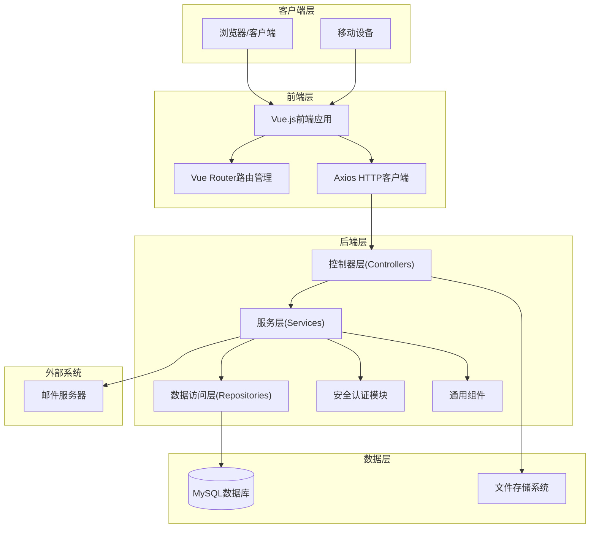
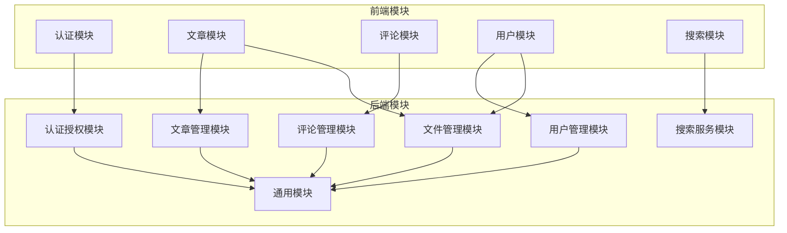
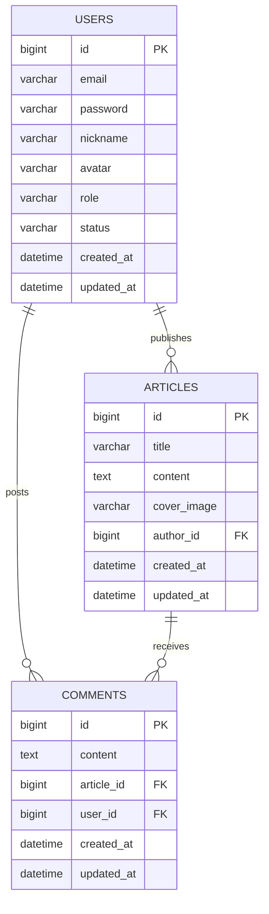
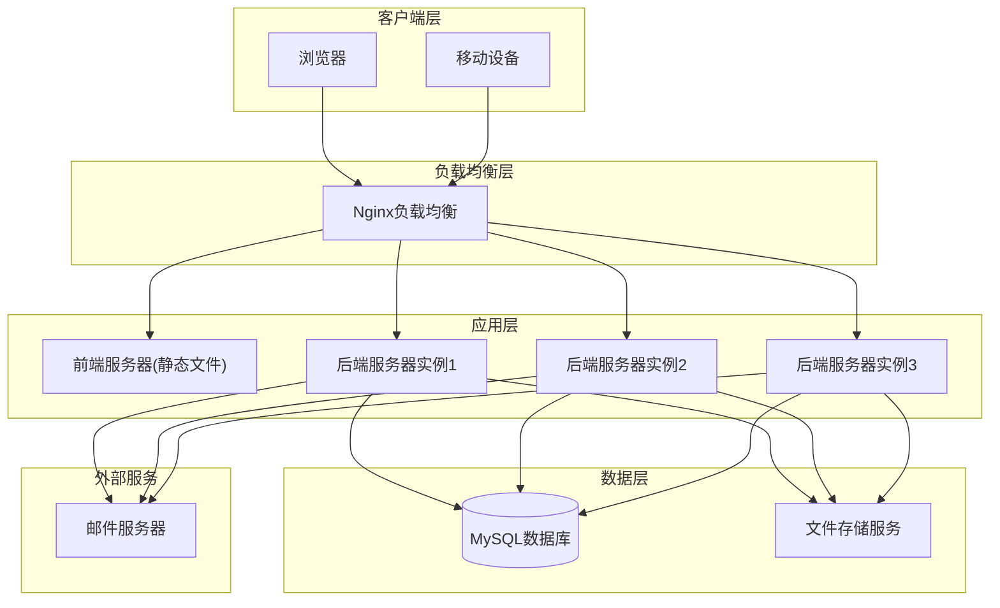

# 博客系统概要设计文档

## 1. 简介

### 1.1 文档目的
本文档旨在详细描述博客系统的总体架构设计、模块划分、接口设计、技术栈选型、数据库设计、安全架构及部署架构，为项目开发团队提供系统层面的设计指导。

### 1.2 术语定义
| 术语 | 解释 |
|------|------|
| 前后端分离架构 | 前端和后端作为独立的系统进行开发和部署，通过API进行通信 |
| MVC | Model-View-Controller，一种软件架构模式 |
| RESTful API | 遵循REST架构风格的应用程序接口 |
| JWT | JSON Web Token，一种用于身份验证的安全令牌 |
| ORM | Object-Relational Mapping，对象关系映射，用于数据库操作 |
| CDN | Content Delivery Network，内容分发网络，用于加速静态资源访问 |

## 2. 系统总体架构

### 2.1 架构风格
系统采用前后端分离的分层架构设计，将用户界面与业务逻辑完全分离，通过RESTful API进行通信。后端采用经典的MVC（Model-View-Controller）架构，前端采用Vue.js的组件化架构。

### 2.2 系统架构图

### 2.3 分层说明

1. **客户端层**：用户通过浏览器或移动设备访问系统。

2. **前端层**：
   - Vue.js前端应用：负责用户界面的渲染和交互
   - Vue Router：负责前端路由管理
   - Axios：负责与后端API的通信

3. **后端层**：
   - 控制器层(Controllers)：处理HTTP请求，调用服务层处理业务逻辑，返回响应
   - 服务层(Services)：实现核心业务逻辑
   - 数据访问层(Repositories)：负责数据持久化操作
   - 安全认证模块：处理用户认证和授权
   - 通用组件：提供系统通用功能支持

4. **数据层**：
   - MySQL数据库：存储系统所有结构化数据
   - 文件存储系统：存储上传的图片文件

5. **外部系统**：
   - 邮件服务器：发送验证邮件和密码重置邮件

## 3. 模块划分

### 3.1 系统模块图

### 3.2 模块职责说明

#### 3.2.1 前端模块

1. **认证模块**：
   - 登录页面
   - 注册页面
   - 忘记密码页面
   - 处理JWT令牌的存储和使用

2. **文章模块**：
   - 文章列表页面
   - 文章详情页面
   - 文章创建和编辑页面
   - 文章搜索和筛选

3. **评论模块**：
   - 评论列表显示
   - 评论发布功能
   - 评论删除功能

4. **用户模块**：
   - 个人中心页面
   - 用户信息编辑
   - 头像上传

5. **搜索模块**：
   - 全局搜索功能
   - 搜索结果显示

#### 3.2.2 后端模块

1. **认证授权模块**：
   - 用户注册验证
   - 用户登录认证
   - JWT令牌生成和验证
   - 基于角色的权限控制

2. **用户管理模块**：
   - 用户信息CRUD操作
   - 用户密码管理
   - 用户状态管理（启用/禁用）
   - 管理员用户管理功能

3. **文章管理模块**：
   - 文章CRUD操作
   - 文章分页和排序
   - 文章搜索功能
   - 文章访问权限控制

4. **评论管理模块**：
   - 评论CRUD操作
   - 评论分页和排序
   - 评论按文章和用户查询
   - 评论权限控制

5. **文件管理模块**：
   - 文件上传处理
   - 文件存储和管理
   - 文件访问URL生成
   - 文件删除功能

6. **搜索服务模块**：
   - 实现全局搜索功能
   - 支持多种搜索条件组合
   - 搜索结果排序和分页

7. **通用模块**：
   - 全局异常处理
   - 响应结果格式化
   - 工具类和辅助功能
   - 配置管理

## 4. 模块间接口设计

### 4.1 前端与后端接口

#### 4.1.1 认证相关接口

| API路径 | 方法 | 功能描述 | 请求体(JSON) | 成功响应(200 OK) |
|---------|------|----------|--------------|------------------|
| `/api/users/send-verification` | POST | 发送验证邮件 | `{"email": "user@example.com"}` | `{"code": 200, "message": "success", "data": null}` |
| `/api/users/register` | POST | 用户注册 | `{"email": "user@example.com", "nickname": "用户名", "password": "密码", "code": "验证码"}` | `{"code": 200, "message": "success", "data": null}` |
| `/api/users/login` | POST | 用户登录 | `{"email": "user@example.com", "password": "密码"}` | `{"code": 200, "message": "success", "data": {"token": "JWT令牌"}}` |
| `/api/users/forgot-password/send-code` | POST | 发送找回密码验证码 | `{"email": "user@example.com"}` | `{"code": 200, "message": "success", "data": null}` |
| `/api/users/forgot-password/verify-code` | POST | 验证找回密码验证码 | `{"email": "user@example.com", "code": "验证码"}` | `{"code": 200, "message": "success", "data": {"valid": true}}` |
| `/api/users/forgot-password/reset` | POST | 重置密码 | `{"email": "user@example.com", "code": "验证码", "password": "新密码"}` | `{"code": 200, "message": "success", "data": null}` |

#### 4.1.2 用户相关接口

| API路径 | 方法 | 功能描述 | 请求体(JSON) | 成功响应(200 OK) |
|---------|------|----------|--------------|------------------|
| `/api/users/me` | GET | 获取当前用户信息 | N/A | `{"code": 200, "message": "success", "data": {用户信息}}` |
| `/api/users/me` | PUT | 更新当前用户信息 | `{"nickname": "新昵称", "avatar": "头像URL"}` | `{"code": 200, "message": "success", "data": {更新后的用户信息}}` |
| `/api/users/nickname/available` | GET | 检查昵称是否可用 | N/A（参数：nickname, excludeUserId） | `{"code": 200, "message": "success", "data": {"available": true}}` |
| `/api/users/admin` | GET | 获取用户列表(管理员) | N/A（分页参数） | `{"code": 200, "message": "success", "data": {分页用户列表}}` |
| `/api/users/admin/{userId}/disable` | PUT | 禁用用户(管理员) | N/A | `{"code": 200, "message": "success", "data": null}` |
| `/api/users/admin/{userId}/enable` | PUT | 启用用户(管理员) | N/A | `{"code": 200, "message": "success", "data": null}` |
| `/api/users/admin/{userId}` | DELETE | 删除用户(管理员) | N/A | `{"code": 200, "message": "success", "data": null}` |

#### 4.1.3 文章相关接口

| API路径 | 方法 | 功能描述 | 请求体(JSON) | 成功响应(200 OK) |
|---------|------|----------|--------------|------------------|
| `/api/articles` | POST | 创建文章 | `{"title": "文章标题", "content": "文章内容", "coverImage": "封面图片URL"}` | `{"code": 200, "message": "success", "data": {创建的文章}}` |
| `/api/articles` | GET | 获取文章列表 | N/A（分页、搜索参数） | `{"code": 200, "message": "success", "data": {分页文章列表}}` |
| `/api/articles/{id}` | GET | 获取文章详情 | N/A | `{"code": 200, "message": "success", "data": {文章详情}}` |
| `/api/articles/{id}` | PUT | 更新文章 | `{"title": "新标题", "content": "新内容", "coverImage": "新封面URL"}` | `{"code": 200, "message": "success", "data": {更新后的文章}}` |
| `/api/articles/{id}` | DELETE | 删除文章 | N/A | `{"code": 200, "message": "success", "data": null}` |

#### 4.1.4 评论相关接口

| API路径 | 方法 | 功能描述 | 请求体(JSON) | 成功响应(200 OK) |
|---------|------|----------|--------------|------------------|
| `/api/comments` | POST | 创建评论 | `{"articleId": 1, "content": "评论内容"}` | `{"code": 200, "message": "success", "data": {创建的评论}}` |
| `/api/comments/article/{articleId}` | GET | 获取文章评论 | N/A（分页参数） | `{"code": 200, "message": "success", "data": {分页评论列表}}` |
| `/api/comments/article/{articleId}/count` | GET | 获取文章评论数 | N/A | `{"code": 200, "message": "success", "data": 评论总数}` |
| `/api/comments/user/{userId}` | GET | 获取用户评论 | N/A（分页参数） | `{"code": 200, "message": "success", "data": {分页评论列表}}` |
| `/api/comments` | GET | 获取所有评论(管理员) | N/A（分页、搜索参数） | `{"code": 200, "message": "success", "data": {分页评论列表}}` |
| `/api/comments/{id}` | DELETE | 删除评论 | N/A | `{"code": 200, "message": "success", "data": null}` |

#### 4.1.5 文件相关接口

| API路径 | 方法 | 功能描述 | 请求体(FormData) | 成功响应(200 OK) |
|---------|------|----------|------------------|------------------|
| `/api/files/upload` | POST | 上传文件 | `file: 二进制文件` | `{"url": "文件URL", "filename": "文件名"}` |
| `/api/files/delete/{filename}` | DELETE | 删除文件 | N/A | `{"code": 200, "message": "success", "data": null}` |

### 4.2 后端内部模块接口

#### 4.2.1 认证模块与用户模块
- `UserService.login()`: 用户登录验证
- `UserService.register()`: 用户注册处理
- `UserService.getCurrentUser()`: 获取当前登录用户

#### 4.2.2 文章模块与文件模块
- `FileUtils.saveFile()`: 保存上传的文件
- `FileUtils.deleteFile()`: 删除文件

#### 4.2.3 通用模块与其他模块
- `ResponseResult.success()/error()`: 统一响应结果格式
- `GlobalExceptionHandler.handleException()`: 全局异常处理

## 5. 技术栈选型

### 5.1 前端技术栈

| 技术/框架 | 版本 | 用途 | 选型理由 |
|-----------|------|------|----------|
| Vue.js | 3.2.47 | 前端框架 | 轻量级、高性能、组件化开发、响应式数据绑定 |
| Vue Router | 4.1.6 | 前端路由 | 官方路由管理器，支持嵌套路由、动态路由等功能 |
| Axios | 1.3.4 | HTTP客户端 | 功能丰富的HTTP库，支持拦截器、请求取消等特性 |
| Vue Quill Editor | 3.0.6 | 富文本编辑器 | 提供强大的文本编辑功能，支持富文本格式 |
| Vite | 4.2.0 | 构建工具 | 快速的开发服务器和构建工具，提供良好的开发体验 |

### 5.2 后端技术栈

| 技术/框架 | 版本 | 用途 | 选型理由 |
|-----------|------|------|----------|
| Java | 11 | 编程语言 | 成熟稳定、生态丰富、企业级支持 |
| Spring Boot | 2.7.5 | 后端框架 | 简化Spring应用开发，提供自动配置、嵌入式服务器等功能 |
| Spring Security | 内置于Spring Boot | 安全框架 | 提供全面的认证和授权功能 |
| Spring Data JPA | 内置于Spring Boot | ORM框架 | 简化数据库操作，提供对象关系映射功能 |
| MySQL | 8.x | 数据库 | 成熟稳定、高性能、广泛使用的关系型数据库 |
| JWT | 0.9.1 | 身份验证 | 无状态认证，便于系统水平扩展 |
| Lombok | 内置于Spring Boot | 代码简化工具 | 减少样板代码，提高开发效率 |
| Spring Boot Mail | 内置于Spring Boot | 邮件服务 | 用于发送验证邮件和密码重置邮件 |

### 5.3 部署与运维技术栈

| 技术/工具 | 用途 | 选型理由 |
|-----------|------|----------|
| Docker | 容器化 | 便于应用部署和环境一致性管理 |
| Nginx | Web服务器 | 高性能的HTTP和反向代理服务器 |
| Maven | 构建工具 | 管理依赖、构建和打包应用 |
| Git | 版本控制 | 代码管理和协作开发 |

## 6. 数据库总体设计

### 6.1 数据库架构

系统采用关系型数据库MySQL存储结构化数据，数据库命名为`blog_system`，主要包含以下表：

- `users`: 用户信息表
- `articles`: 文章表
- `comments`: 评论表

### 6.2 表间关系图

### 6.3 数据存储策略

1. **结构化数据**：存储在MySQL数据库中
2. **非结构化数据**：
   - 用户上传的图片等文件存储在文件系统中
   - 文件路径和URL信息存储在数据库中

## 7. 安全架构

### 7.1 身份认证与授权

1. **用户认证**：
   - 基于JWT的身份认证机制
   - 登录成功后生成JWT令牌
   - 令牌包含用户ID和角色信息
   - 令牌设置过期时间

2. **授权机制**：
   - 基于角色的访问控制（RBAC）
   - 定义不同角色的权限范围
   - 使用Spring Security实现权限验证

3. **访问控制**：
   - 接口级别的权限控制
   - 资源级别的所有权验证（如用户只能编辑自己的文章）

### 7.2 数据安全

1. **密码安全**：
   - 密码加密存储（使用BCrypt或类似算法）
   - 禁止明文存储密码

2. **数据传输安全**：
   - 使用HTTPS协议确保数据传输加密
   - API请求验证和签名

3. **SQL注入防护**：
   - 使用参数化查询
   - 避免直接拼接SQL语句

4. **XSS攻击防护**：
   - 输入验证和过滤
   - 输出编码

### 7.3 文件安全

1. **文件类型验证**：
   - 限制上传文件类型为图片格式
   - 验证文件MIME类型

2. **路径遍历防护**：
   - 严格验证文件路径
   - 避免直接使用用户输入构建文件路径

3. **文件大小限制**：
   - 限制上传文件大小
   - 防止DOS攻击

## 8. 部署架构

### 8.1 部署架构图

### 8.2 部署环境

1. **开发环境**：
   - 本地开发机器
   - 开发数据库
   - 调试工具

2. **测试环境**：
   - 专用测试服务器
   - 测试数据库（与生产数据隔离）
   - 自动化测试工具

3. **生产环境**：
   - 高可用服务器集群
   - 主从数据库架构
   - 负载均衡器
   - 监控系统

### 8.3 扩展性考虑

1. **水平扩展**：
   - 后端服务无状态设计，支持多实例部署
   - 使用负载均衡器分发请求

2. **垂直扩展**：
   - 服务器硬件配置可根据需求升级
   - 数据库性能优化和配置调优

3. **数据库扩展**：
   - 支持读写分离
   - 支持数据库分片（未来扩展）

## 9. 监控与维护

### 9.1 系统监控

1. **健康检查**：
   - 定期检查系统各组件健康状态
   - 自动报警机制

2. **性能监控**：
   - 响应时间监控
   - 系统资源使用率监控
   - 数据库性能监控

3. **日志管理**：
   - 集中式日志收集
   - 日志分析和异常检测

### 9.2 维护计划

1. **定期维护**：
   - 系统更新和补丁管理
   - 数据库优化和清理

2. **备份策略**：
   - 定期数据备份
   - 备份验证和恢复测试

3. **容量规划**：
   - 存储空间监控和扩展
   - 用户增长预测和资源规划

## 10. 参考资料

- Spring Boot官方文档
- Vue.js官方文档
- Spring Security参考手册
- MySQL性能优化指南
- JWT最佳实践
- Docker部署指南

