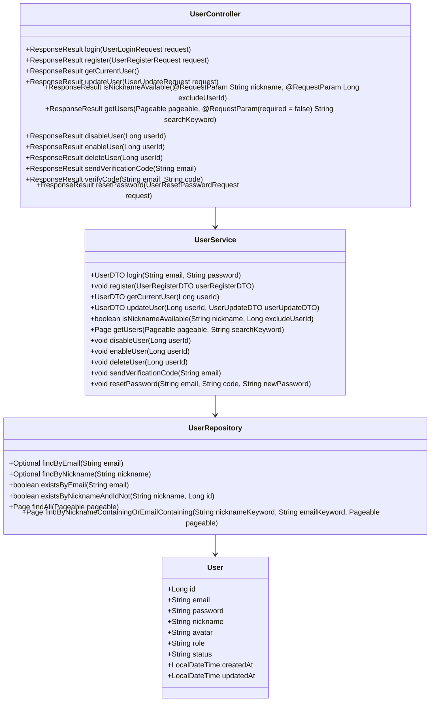
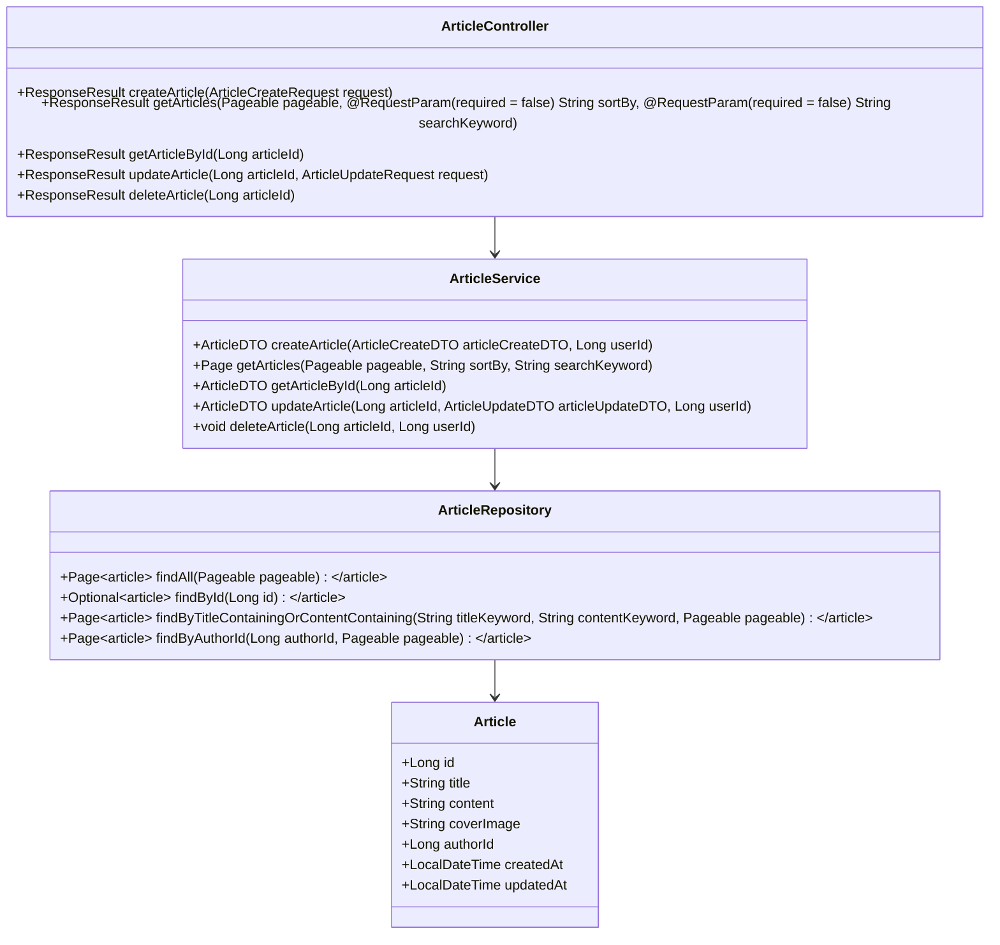
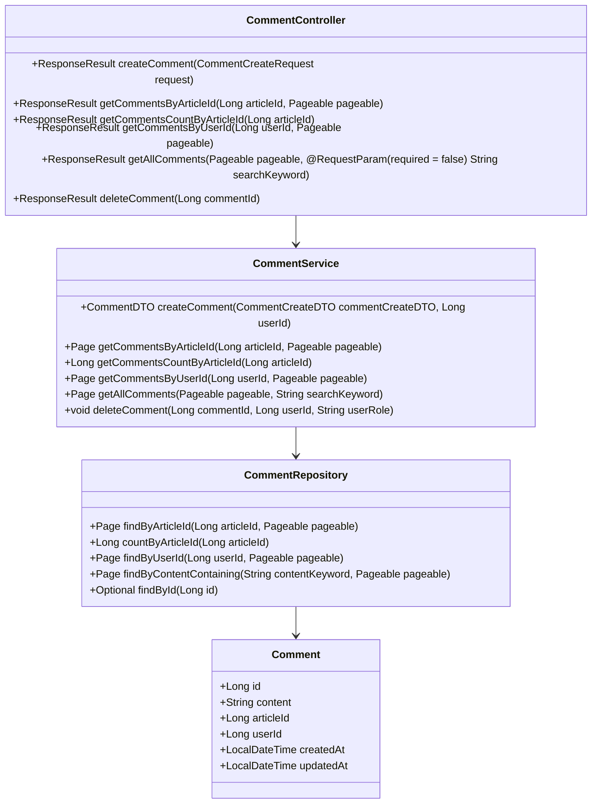
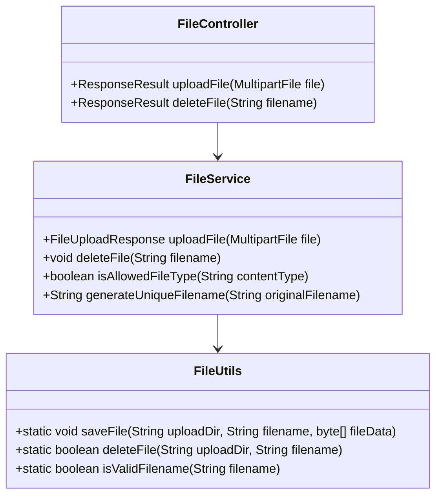
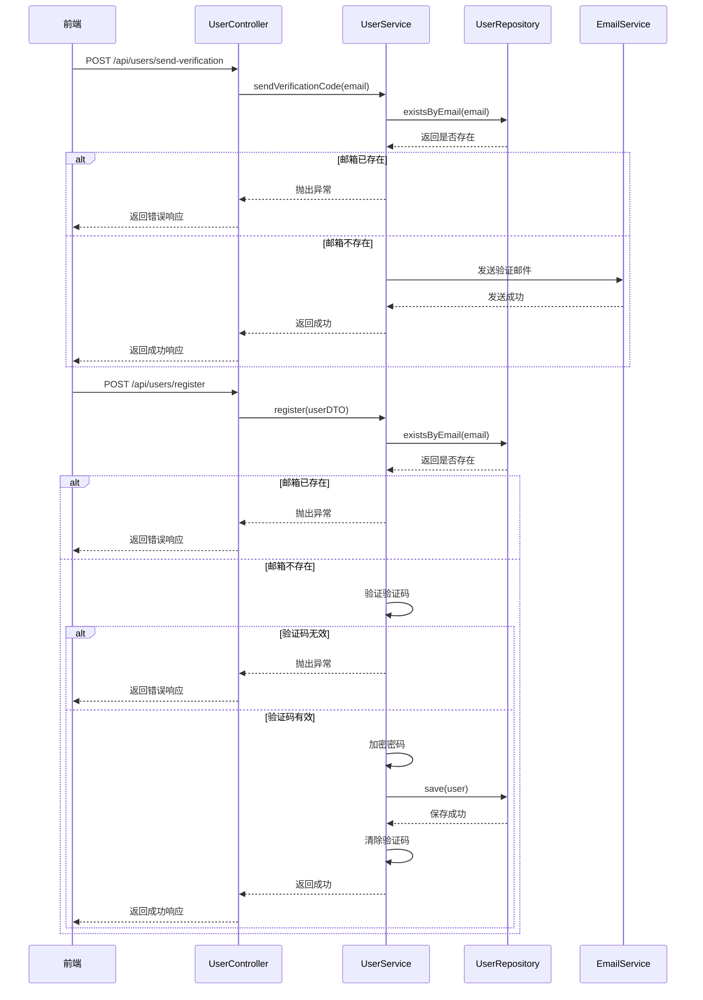
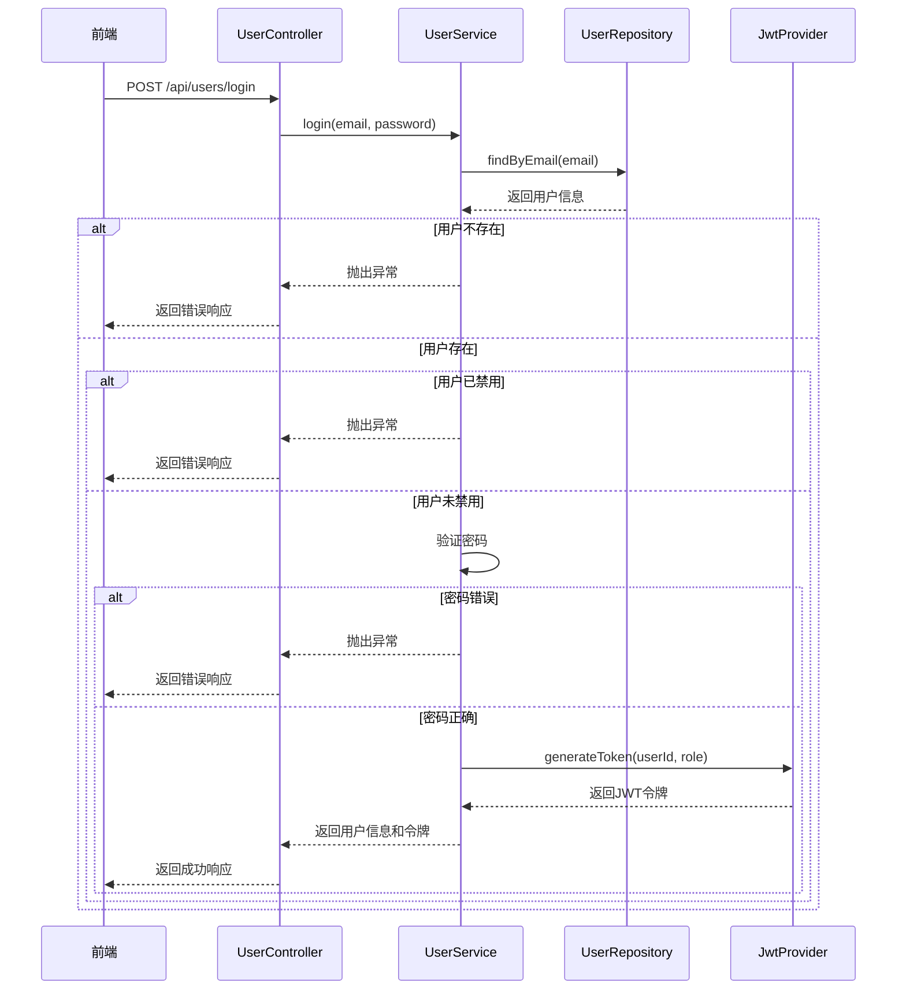
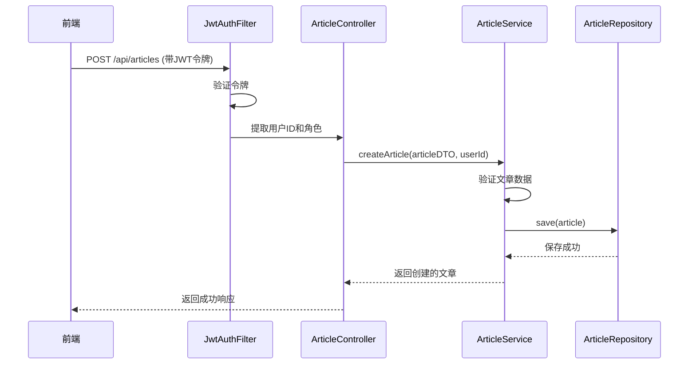
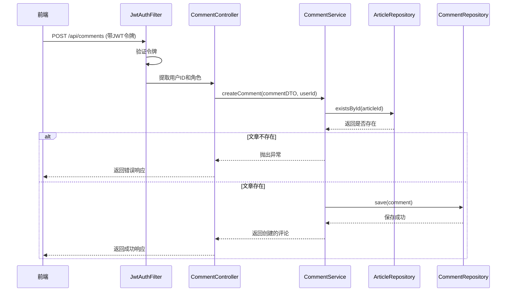
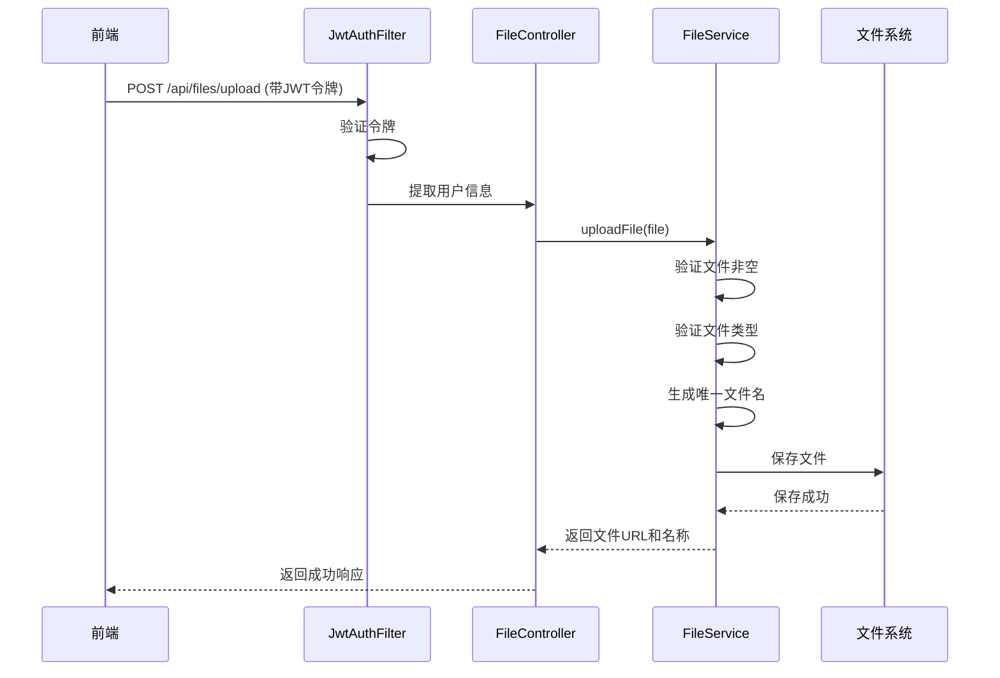

# 博客系统详细设计文档

## 1. 简介

### 1.1 文档目的
本文档旨在详细描述博客系统的内部实现细节、类结构设计、核心算法、数据结构、接口详细定义、数据库表结构及关键业务流程的实现方案，为开发团队提供具体的技术实现指导。

### 1.2 术语定义
| 术语 | 解释 |
|------|------|
| POJO | Plain Old Java Object，简单的Java对象 |
| DTO | Data Transfer Object，数据传输对象 |
| DAO | Data Access Object，数据访问对象 |
| AOP | Aspect-Oriented Programming，面向切面编程 |
| ORM | Object-Relational Mapping，对象关系映射 |
| JPA | Java Persistence API，Java持久化API |
| BCrypt | 一种密码哈希算法，用于安全存储密码 |
| JWT | JSON Web Token，基于JSON的开放标准令牌 |

### 1.3 技术栈

#### 1.3.1 后端技术栈
- **框架**: Spring Boot 2.7.5
- **ORM**: Spring Data JPA
- **安全框架**: Spring Security
- **身份认证**: JWT (JSON Web Token)
- **数据库**: MySQL
- **邮件服务**: Spring Boot Mail
- **工具库**: Lombok
- **JDK**: 11

#### 1.3.2 前端技术栈
- **框架**: Vue 3.2.47
- **路由**: Vue Router 4.1.6
- **HTTP客户端**: Axios 1.3.4
- **富文本编辑器**: Vue Quill Editor 3.0.6
- **构建工具**: Vite 4.2.0

### 1.4 项目结构

#### 1.4.1 后端项目结构
```
backend/
├── pom.xml                  # Maven项目配置文件
├── src/
│   └── main/
│       ├── java/
│       │   └── com/
│       │       └── blog/
│       │           ├── BlogApplication.java  # 应用程序入口
│       │           ├── article/              # 文章模块
│       │           │   ├── controller/
│       │           │   │   └── ArticleController.java
│       │           │   ├── dto/
│       │           │   │   ├── ArticleCreateDTO.java
│       │           │   │   └── ArticleUpdateDTO.java
│       │           │   ├── entity/
│       │           │   │   └── Article.java
│       │           │   ├── repository/
│       │           │   │   └── ArticleRepository.java
│       │           │   └── service/
│       │           │       ├── ArticleService.java
│       │           │       └── impl/
│       │           │           └── ArticleServiceImpl.java
│       │           ├── comment/              # 评论模块
│       │           │   ├── controller/
│       │           │   │   └── CommentController.java
│       │           │   ├── dto/
│       │           │   │   ├── CommentDTO.java
│       │           │   │   └── CommentRequest.java
│       │           │   ├── entity/
│       │           │   │   └── Comment.java
│       │           │   ├── repository/
│       │           │   │   └── CommentRepository.java
│       │           │   └── service/
│       │           │       ├── CommentService.java
│       │           │       └── impl/
│       │           │           └── CommentServiceImpl.java
│       │           ├── common/               # 公共模块
│       │           │   ├── GlobalExceptionHandler.java
│       │           │   └── ResponseResult.java
│       │           ├── config/               # 配置模块
│       │           │   └── WebConfig.java
│       │           ├── file/                 # 文件模块
│       │           │   ├── config/
│       │           │   │   └── FileStorageConfig.java
│       │           │   ├── controller/
│       │           │   │   └── FileController.java
│       │           │   └── util/
│       │           │       └── FileUtils.java
│       │           ├── security/             # 安全模块
│       │           │   ├── JwtFilter.java
│       │           │   ├── JwtProvider.java
│       │           │   └── SecurityConfig.java
│       │           └── user/                 # 用户模块
│       │               ├── controller/
│       │               │   └── UserController.java
│       │               ├── dto/
│       │               │   ├── EmailDTO.java
│       │               │   ├── ForgotPasswordDTO.java
│       │               │   ├── ResetPasswordDTO.java
│       │               │   ├── UpdateUserDTO.java
│       │               │   ├── UserLoginDTO.java
│       │               │   ├── UserRegisterDTO.java
│       │               │   └── VerifyCodeDTO.java
│       │               ├── entity/
│       │               │   └── User.java
│       │               ├── repository/
│       │               │   └── UserRepository.java
│       │               ├── service/
│       │               │   ├── UserService.java
│       │               │   └── impl/
│       │               │       ├── UserDetailsServiceImpl.java
│       │               │       └── UserServiceImpl.java
│       │               └── util/
│       │                   └── UserRoleUtil.java
│       └── resources/
│           └── application.properties        # 应用配置文件
└── uploads/                                  # 文件上传目录
```

#### 1.4.2 前端项目结构
```
frontend/
├── index.html               # HTML入口文件
├── package.json             # NPM项目配置文件
├── src/
│   ├── App.vue              # Vue根组件
│   ├── axios.js             # Axios配置
│   ├── main.js              # 应用入口文件
│   ├── router.js            # 路由配置
│   ├── assets/              # 静态资源
│   │   ├── images/          # 图片资源
│   │   │   ├── avatar.jpg
│   │   │   ├── default_cover.png
│   │   │   ├── icon-eye-close.png
│   │   │   └── icon-eye-open.png
│   │   └── js/              # JavaScript资源（空）
│   └── views/               # 页面组件
│       ├── AdminDashboard.vue    # 管理后台
│       ├── ArticleDetail.vue     # 文章详情
│       ├── CreateArticle.vue     # 创建文章
│       ├── ForgotPassword.vue    # 忘记密码
│       ├── Home.vue             # 首页
│       ├── Login.vue            # 登录页
│       ├── Profile.vue          # 个人资料
│       └── Register.vue         # 注册页
└── vite.config.js           # Vite配置文件
```

## 2. 前端详细设计

### 2.1 页面结构设计

#### 2.1.1 主页面布局
主页面采用响应式布局设计，包含导航栏、主内容区域和页脚三个主要部分。实际实现中使用了更详细的布局结构和样式。

```html
<template>
  <div class="app">
    <header class="header">
      <nav class="nav">
        <div class="container">
          <router-link to="/" class="logo">博客系统</router-link>
          
          <!-- 移动端菜单按钮 -->
          <button class="mobile-menu-btn" :class="{ 'active': showMobileMenu }" @click="toggleMobileMenu" aria-label="菜单">
            <span class="menu-icon"></span>
            <span class="menu-icon"></span>
            <span class="menu-icon"></span>
          </button>
          
          <!-- 搜索功能组件 -->
          <div class="search-container">
            <select v-model="searchType" class="search-type-select">
              <option value="all">全部搜索</option>
              <option value="title_content">文章内容</option>
              <option value="author">作者昵称</option>
            </select>
            <input 
              type="text" 
              v-model="searchKeyword" 
              :placeholder="getSearchPlaceholder()" 
              class="search-input"
              @keyup.enter="handleSearch"
            >
            <button @click="handleSearch" class="search-button">搜索</button>
          </div>
          
          <div class="nav-links" :class="{ 'mobile-menu-open': showMobileMenu }">
            <router-link to="/" class="nav-link" @click.native="handleHomeClick; showMobileMenu = false">首页</router-link>
            <router-link v-if="isLoggedIn" to="/create" class="nav-link" @click.native="showMobileMenu = false">写文章</router-link>
            <router-link v-if="isLoggedIn" to="/profile" class="nav-link" @click.native="showMobileMenu = false">个人中心</router-link>
            <div v-else>
              <router-link to="/login" class="nav-link" @click.native="showMobileMenu = false">登录</router-link>
              <router-link to="/register" class="nav-link" @click.native="showMobileMenu = false">注册</router-link>
            </div>
            
            <!-- 用户头像和昵称，点击显示下拉菜单 -->
            <div v-if="isLoggedIn" class="user-menu-container">
              <div class="user-info" @click="toggleUserMenu">
                
                <span class="user-nickname">{{ user?.nickname || '用户' }}</span>
                <span class="dropdown-arrow" :class="{ 'active': showUserMenu }"></span>
              </div>
              
              <!-- 下拉菜单 -->
              <div v-if="showUserMenu" class="user-dropdown-menu">
                <router-link to="/profile" class="dropdown-item" @click="handleMenuItemClick">个人中心</router-link>
                <router-link to="/create" class="dropdown-item" @click="handleMenuItemClick">写文章</router-link>
                <!-- 管理员中心选项，仅对管理员显示 -->
                <router-link v-if="user?.role === 'ADMIN'" to="/admin/dashboard" class="dropdown-item" @click="handleMenuItemClick">管理员中心</router-link>
                <div class="dropdown-divider"></div>
                <button class="dropdown-item logout-item" @click="handleLogout">退出登录</button>
              </div>
            </div>
          </div>
        </div>
      </nav>
    </header>
    
    <main class="main">
      <div class="container">
        <router-view v-slot="{ Component }">
          <transition name="fade" mode="out-in">
            <component :is="Component" />
          </transition>
        </router-view>
      </div>
    </main>
    
    <footer class="footer">
      <div class="container">
        <p>&copy; 2025 博客系统. All rights reserved.</p>
      </div>
    </footer>
  </div>
</template>
```

#### 2.1.2 响应式设计
使用媒体查询实现不同屏幕尺寸下的布局调整：

```css
/* 大屏幕样式 */
@media (min-width: 1200px) {
  .container {
    width: 1200px;
    margin: 0 auto;
  }
}

/* 平板样式 */
@media (max-width: 1199px) and (min-width: 768px) {
  .container {
    width: 90%;
    margin: 0 auto;
  }
}

/* 移动设备样式 */
@media (max-width: 767px) {
  .container {
    width: 100%;
    padding: 0 10px;
  }
}
```

### 2.2 组件设计

**注**：实际实现中，大部分组件逻辑直接集成在页面视图文件中，而不是单独的组件文件。以下是根据实际实现调整的组件设计说明：

#### 2.2.1 页面视图组件

| 组件名称 | 文件位置 | 功能描述 | 主要功能 |
|---------|---------|----------|--------|
| Home | src/views/Home.vue | 首页/文章列表页面 | 文章展示、排序、分页、搜索结果显示 |
| ArticleDetail | src/views/ArticleDetail.vue | 文章详情页面 | 文章内容展示、评论功能 |
| Login | src/views/Login.vue | 登录页面 | 用户登录认证 |
| Register | src/views/Register.vue | 注册页面 | 用户注册 |
| CreateArticle | src/views/CreateArticle.vue | 创建/编辑文章页面 | 文章编辑、保存、上传封面图 |
| Profile | src/views/Profile.vue | 个人中心页面 | 用户信息管理、我的文章 |
| ForgotPassword | src/views/ForgotPassword.vue | 忘记密码页面 | 密码重置流程 |
| AdminDashboard | src/views/AdminDashboard.vue | 管理员控制台 | 用户管理、文章管理等 |

#### 2.2.2 主应用组件 (App.vue)

主应用组件(App.vue)包含了大部分通用功能，如：
- 导航栏和用户菜单
- 全局搜索功能
- 登录状态管理
- 响应式布局处理

主要功能实现包括：

```javascript
// App.vue 核心功能
export default {
  name: 'App',
  setup() {
    // 状态管理
    const isLoggedIn = ref(false)
    const user = ref(null)
    const showUserMenu = ref(false)
    const showMobileMenu = ref(false)
    
    // 搜索相关
    const searchKeyword = ref('')
    const searchType = ref('all')
    
    // 登录状态检查
    const checkLoginStatus = () => {
      const token = localStorage.getItem('token')
      isLoggedIn.value = !!token
      if (isLoggedIn.value) {
        try {
          const userStr = localStorage.getItem('user')
          user.value = userStr ? JSON.parse(userStr) : null
        } catch (e) {
          console.error('解析用户信息失败:', e)
          user.value = null
        }
      }
    }
    
    // 登出功能
    const handleLogout = () => {
      localStorage.removeItem('token')
      localStorage.removeItem('user')
      isLoggedIn.value = false
      user.value = null
      // ...其他处理
    }
    
    // 搜索功能
    const handleSearch = () => {
      // 更新全局搜索状态
      window.globalSearchState = {
        keyword: searchKeyword.value,
        type: searchType.value,
        timestamp: Date.now()
      }
      // ...搜索导航逻辑
    }
    
    // ...其他功能
    
    return {
      // 暴露的方法和状态
    }
  }
}
  try {
    const response = await axios.post('/api/users/login', {
      email: email.value,
      password: password.value
    });
    
    if (response.data.code === 200) {
      localStorage.setItem('token', response.data.data.token);
      await router.push('/');
    }
  } catch (error) {
    errorMsg.value = error.response?.data?.message || '登录失败';
  } finally {
    isLoading.value = false;
  }
};
```

#### 2.2.2 文章相关功能实现

**注**：在实际实现中，文章相关功能直接在页面视图中实现，没有单独的组件文件。以下是主要功能点：

1. **文章列表展示** (Home.vue)
   - 通过axios请求`/api/articles`获取文章数据
   - 支持多种排序方式（最新、最热、推荐）
   - 实现分页功能，每页显示固定数量的文章
   - 响应式卡片布局，包含封面图、标题、摘要、作者信息等
   - 骨架屏加载状态

2. **文章详情** (ArticleDetail.vue)
   - 展示完整文章内容，支持富文本格式
   - 文章评论系统
   - 相关文章推荐

3. **文章编辑** (CreateArticle.vue)
   - 富文本编辑器
   - 封面图上传
   - 文章分类和标签管理
   - 草稿保存功能

#### 2.2.3 核心业务功能

实际实现中的主要业务功能集中在以下几个方面：

1. **全局搜索功能**
   - 支持搜索文章标题、内容、作者
   - 实现全局搜索状态共享
   - 搜索结果实时更新

2. **用户认证与权限控制**
   - 基于localStorage的登录状态管理
   - 路由守卫确保权限控制
   - 用户菜单和角色权限检查

3. **响应式布局**
   - 适配桌面端和移动端
   - 移动端导航菜单
   - 响应式文章卡片布局

4. **数据获取与状态管理**
   - 使用axios进行API调用
   - 组件内状态管理（Composition API）
   - 全局状态共享（通过localStorage和window对象）

### 2.3 路由设计

实际实现中，路由配置位于 `src/router.js`，包含以下内容：

```javascript
// src/router.js
import { createRouter, createWebHistory } from 'vue-router';
import Home from './views/Home.vue';
import ArticleDetail from './views/ArticleDetail.vue';
import Login from './views/Login.vue';
import Register from './views/Register.vue';
import ForgotPassword from './views/ForgotPassword.vue';
import CreateArticle from './views/CreateArticle.vue';
import Profile from './views/Profile.vue';
import AdminDashboard from './views/AdminDashboard.vue';

const routes = [
  {
    path: '/',
    name: 'Home',
    component: Home,
    meta: {
      title: '博客首页'
    }
  },
  {
    path: '/article/:id',
    name: 'ArticleDetail',
    component: ArticleDetail,
    meta: {
      title: '文章详情'
    }
  },
  {
    path: '/login',
    name: 'Login',
    component: Login,
    meta: {
      title: '登录',
      requiresAuth: false
    }
  },
  {
    path: '/register',
    name: 'Register',
    component: Register,
    meta: {
      title: '注册',
      requiresAuth: false
    }
  },
  {
    path: '/forgot-password',
    name: 'ForgotPassword',
    component: ForgotPassword,
    meta: {
      title: '忘记密码',
      requiresAuth: false
    }
  },
  {
    path: '/article/create',
    name: 'CreateArticle',
    component: CreateArticle,
    meta: {
      title: '创建文章',
      requiresAuth: true
    }
  },
  {
    path: '/profile',
    name: 'Profile',
    component: Profile,
    meta: {
      title: '个人中心',
      requiresAuth: true
    }
  },
  {
    path: '/admin',
    name: 'AdminDashboard',
    component: AdminDashboard,
    meta: {
      title: '管理员控制台',
      requiresAuth: true,
      requiresAdmin: true
    }
  }
];

const router = createRouter({
  history: createWebHistory(),
  routes
});

// 路由守卫
router.beforeEach((to, from, next) => {
  // 设置页面标题
  document.title = to.meta.title || '博客系统';
  
  // 检查登录状态
  const token = localStorage.getItem('token');
  const isLoggedIn = !!token;
  
  // 检查路由是否需要认证
  if (to.meta.requiresAuth === true && !isLoggedIn) {
    // 需要认证但未登录，重定向到登录页
    next({ path: '/login', query: { redirect: to.fullPath } });
    return;
  }
  
  // 检查是否需要管理员权限
  if (to.meta.requiresAdmin && isLoggedIn) {
    try {
      const userStr = localStorage.getItem('user');
      const user = userStr ? JSON.parse(userStr) : null;
      
      if (!user || !user.isAdmin) {
        // 不是管理员，重定向到首页
        next('/');
        return;
      }
    } catch (e) {
      console.error('解析用户信息失败:', e);
      next('/');
      return;
    }
  }
  
  // 允许访问
  next();
});

export default router;
```

### 2.4 状态管理

实际实现中，前端采用以下方式进行状态管理：

1. **组件内状态管理**
   - 使用Vue 3 Composition API（ref、reactive）管理组件内部状态
   - 各页面视图（如Home.vue、ArticleDetail.vue等）独立管理自己的数据状态

2. **全局状态管理**
   - 登录状态和用户信息主要通过localStorage进行存储和共享
   - App.vue作为主组件管理核心全局状态
   - 搜索功能使用window对象进行全局状态共享

3. **主要状态管理逻辑**

   ```javascript
   // App.vue 中的核心状态管理
   setup() {
     // 登录状态管理
     const isLoggedIn = ref(false)
     const user = ref(null)
     
     // 检查登录状态（页面加载时执行）
     const checkLoginStatus = () => {
       const token = localStorage.getItem('token')
       isLoggedIn.value = !!token
       if (isLoggedIn.value) {
         try {
           const userStr = localStorage.getItem('user')
           user.value = userStr ? JSON.parse(userStr) : null
         } catch (e) {
           console.error('解析用户信息失败:', e)
           user.value = null
         }
       }
     }
     
     // 全局搜索状态共享
     const searchKeyword = ref('')
     const searchType = ref('all')
     
     // 处理登录成功
     const handleLoginSuccess = (userInfo, token) => {
       localStorage.setItem('token', token)
       localStorage.setItem('user', JSON.stringify(userInfo))
       isLoggedIn.value = true
       user.value = userInfo
     }
     
     // 组件挂载时检查登录状态
     onMounted(() => {
       checkLoginStatus()
     })
     
     return {
       // 暴露状态和方法
     }
   }
   ```

4. **路由守卫中的状态检查**
   - 通过检查localStorage中的token来判断登录状态
   - 实现权限控制和页面重定向逻辑
   - 在路由变化时动态更新页面标题


## 3. 后端详细设计

### 3.1 后端整体架构

后端采用经典的三层架构设计：

1. **表示层(Controller)**：处理HTTP请求，调用服务层方法，返回响应
2. **业务层(Service)**：实现业务逻辑，调用数据访问层方法
3. **数据访问层(Repository)**：与数据库交互，执行CRUD操作

### 3.2 核心模块详细设计

#### 3.2.1 用户管理模块

##### 3.2.1.1 类结构设计



##### 3.2.1.2 核心方法实现

**UserService.login()方法实现**：
```java
public UserDTO login(String email, String password) {
    // 查找用户
    User user = userRepository.findByEmail(email)
            .orElseThrow(() -> new BusinessException("用户不存在"));
    
    // 检查用户状态
    if ("DISABLED".equals(user.getStatus())) {
        throw new BusinessException("用户已被禁用");
    }
    
    // 验证密码
    if (!passwordEncoder.matches(password, user.getPassword())) {
        throw new BusinessException("密码错误");
    }
    
    // 生成JWT令牌
    String token = jwtProvider.generateToken(user.getId(), user.getRole());
    
    // 构建用户DTO
    UserDTO userDTO = new UserDTO();
    userDTO.setId(user.getId());
    userDTO.setEmail(user.getEmail());
    userDTO.setNickname(user.getNickname());
    userDTO.setAvatar(user.getAvatar());
    userDTO.setRole(user.getRole());
    userDTO.setToken(token);
    
    return userDTO;
}
```

**UserService.register()方法实现**：
```java
public void register(UserRegisterDTO userRegisterDTO) {
    // 检查邮箱是否已存在
    if (userRepository.existsByEmail(userRegisterDTO.getEmail())) {
        throw new BusinessException("邮箱已被注册");
    }
    
    // 验证验证码
    boolean isValidCode = verificationCodeService.verifyCode(
            userRegisterDTO.getEmail(), userRegisterDTO.getCode());
    if (!isValidCode) {
        throw new BusinessException("验证码无效或已过期");
    }
    
    // 创建新用户
    User user = new User();
    user.setEmail(userRegisterDTO.getEmail());
    user.setPassword(passwordEncoder.encode(userRegisterDTO.getPassword()));
    user.setNickname(userRegisterDTO.getNickname());
    user.setAvatar(defaultAvatarUrl); // 默认头像
    user.setRole("USER"); // 默认角色
    user.setStatus("ACTIVE");
    user.setCreatedAt(LocalDateTime.now());
    user.setUpdatedAt(LocalDateTime.now());
    
    userRepository.save(user);
    
    // 清除验证码
    verificationCodeService.clearCode(userRegisterDTO.getEmail());
}
```

#### 3.2.2 文章管理模块

##### 3.2.2.1 类结构设计



##### 3.2.2.2 核心方法实现

**ArticleService.createArticle()方法实现**：
```java
public ArticleDTO createArticle(ArticleCreateDTO articleCreateDTO, Long userId) {
    // 创建文章对象
    Article article = new Article();
    article.setTitle(articleCreateDTO.getTitle());
    article.setContent(articleCreateDTO.getContent());
    article.setCoverImage(articleCreateDTO.getCoverImage());
    article.setAuthorId(userId);
    article.setCreatedAt(LocalDateTime.now());
    article.setUpdatedAt(LocalDateTime.now());
    
    // 保存文章
    Article savedArticle = articleRepository.save(article);
    
    // 构建并返回DTO
    return convertToDTO(savedArticle);
}
```

**ArticleService.getArticles()方法实现**：
```java
public Page<ArticleDTO> getArticles(Pageable pageable, String sortBy, String searchKeyword) {
    Page<Article> articlePage;
    
    // 排序处理
    if (StringUtils.hasText(sortBy)) {
        Sort.Direction direction = sortBy.startsWith("-") ? Sort.Direction.DESC : Sort.Direction.ASC;
        String property = sortBy.startsWith("-") ? sortBy.substring(1) : sortBy;
        pageable = PageRequest.of(pageable.getPageNumber(), pageable.getPageSize(), Sort.by(direction, property));
    }
    
    // 搜索处理
    if (StringUtils.hasText(searchKeyword)) {
        articlePage = articleRepository.findByTitleContainingOrContentContaining(
                searchKeyword, searchKeyword, pageable);
    } else {
        articlePage = articleRepository.findAll(pageable);
    }
    
    // 转换为DTO并返回
    return articlePage.map(this::convertToDTO);
}
```

#### 3.2.3 评论管理模块

##### 3.2.3.1 类结构设计



##### 3.2.3.2 核心方法实现

**CommentService.createComment()方法实现**：
```java
public CommentDTO createComment(CommentCreateDTO commentCreateDTO, Long userId) {
    // 验证文章是否存在
    if (!articleRepository.existsById(commentCreateDTO.getArticleId())) {
        throw new BusinessException("文章不存在");
    }
    
    // 创建评论
    Comment comment = new Comment();
    comment.setContent(commentCreateDTO.getContent());
    comment.setArticleId(commentCreateDTO.getArticleId());
    comment.setUserId(userId);
    comment.setCreatedAt(LocalDateTime.now());
    comment.setUpdatedAt(LocalDateTime.now());
    
    // 保存评论
    Comment savedComment = commentRepository.save(comment);
    
    // 构建并返回DTO
    return convertToDTO(savedComment);
}
```

**CommentService.deleteComment()方法实现**：
```java
public void deleteComment(Long commentId, Long userId, String userRole) {
    // 查找评论
    Comment comment = commentRepository.findById(commentId)
            .orElseThrow(() -> new BusinessException("评论不存在"));
    
    // 权限检查：只有评论作者或管理员可以删除评论
    if (!comment.getUserId().equals(userId) && !"ADMIN".equals(userRole)) {
        throw new BusinessException("没有权限删除此评论");
    }
    
    // 删除评论
    commentRepository.delete(comment);
}
```

#### 3.2.4 文件管理模块

##### 3.2.4.1 类结构设计



##### 3.2.4.2 核心方法实现

**FileService.uploadFile()方法实现**：
```java
public FileUploadResponse uploadFile(MultipartFile file) {
    // 检查文件是否为空
    if (file.isEmpty()) {
        throw new BusinessException("上传文件不能为空");
    }
    
    // 验证文件类型
    String contentType = file.getContentType();
    if (!isAllowedFileType(contentType)) {
        throw new BusinessException("只允许上传图片文件");
    }
    
    // 生成唯一文件名
    String originalFilename = file.getOriginalFilename();
    String filename = generateUniqueFilename(originalFilename);
    
    try {
        // 保存文件到磁盘
        byte[] fileData = file.getBytes();
        FileUtils.saveFile(uploadDir, filename, fileData);
        
        // 构建文件URL
        String fileUrl = fileBaseUrl + filename;
        
        // 返回文件信息
        FileUploadResponse response = new FileUploadResponse();
        response.setUrl(fileUrl);
        response.setFilename(filename);
        
        return response;
    } catch (IOException e) {
        throw new BusinessException("文件上传失败: " + e.getMessage());
    }
}
```

**FileUtils.saveFile()方法实现**：
```java
public static void saveFile(String uploadDir, String filename, byte[] fileData) throws IOException {
    // 确保上传目录存在
    File directory = new File(uploadDir);
    if (!directory.exists()) {
        directory.mkdirs();
    }
    
    // 创建文件对象
    File destFile = new File(uploadDir + File.separator + filename);
    
    // 写入文件数据
    Files.write(destFile.toPath(), fileData);
}
```

### 3.3 安全模块详细设计

#### 3.3.1 JWT认证实现

```java
// JwtProvider.java
@Service
public class JwtProvider {
    @Value("${jwt.secret}")
    private String jwtSecret;
    
    @Value("${jwt.expiration}")
    private int jwtExpirationMs;
    
    // 生成JWT令牌
    public String generateToken(Long userId, String role) {
        Date now = new Date();
        Date expiryDate = new Date(now.getTime() + jwtExpirationMs);
        
        Map<String, Object> claims = new HashMap<>();
        claims.put("userId", userId);
        claims.put("role", role);
        
        return Jwts.builder()
                .setClaims(claims)
                .setIssuedAt(now)
                .setExpiration(expiryDate)
                .signWith(SignatureAlgorithm.HS512, jwtSecret)
                .compact();
    }
    
    // 从令牌中提取用户ID
    public Long getUserIdFromToken(String token) {
        Claims claims = Jwts.parser()
                .setSigningKey(jwtSecret)
                .parseClaimsJws(token)
                .getBody();
        
        return Long.parseLong(claims.get("userId").toString());
    }
    
    // 从令牌中提取角色
    public String getRoleFromToken(String token) {
        Claims claims = Jwts.parser()
                .setSigningKey(jwtSecret)
                .parseClaimsJws(token)
                .getBody();
        
        return claims.get("role").toString();
    }
    
    // 验证令牌
    public boolean validateToken(String token) {
        try {
            Jwts.parser().setSigningKey(jwtSecret).parseClaimsJws(token);
            return true;
        } catch (SignatureException e) {
            logger.error("Invalid JWT signature: {}", e.getMessage());
        } catch (MalformedJwtException e) {
            logger.error("Invalid JWT token: {}", e.getMessage());
        } catch (ExpiredJwtException e) {
            logger.error("JWT token is expired: {}", e.getMessage());
        } catch (UnsupportedJwtException e) {
            logger.error("JWT token is unsupported: {}", e.getMessage());
        } catch (IllegalArgumentException e) {
            logger.error("JWT claims string is empty: {}", e.getMessage());
        }
        
        return false;
    }
}
```

#### 3.3.2 Spring Security配置

```java
// SecurityConfig.java
@Configuration
@EnableWebSecurity
public class SecurityConfig extends WebSecurityConfigurerAdapter {
    @Autowired
    private JwtAuthenticationFilter jwtAuthFilter;
    
    @Autowired
    private JwtAuthenticationEntryPoint jwtAuthEntryPoint;
    
    @Bean
    public PasswordEncoder passwordEncoder() {
        return new BCryptPasswordEncoder();
    }
    
    @Override
    protected void configure(HttpSecurity http) throws Exception {
        http
            .csrf().disable()
            .authorizeRequests()
                // 公开API
                .antMatchers("/api/users/login", "/api/users/register", 
                             "/api/users/send-verification", 
                             "/api/users/forgot-password/**",
                             "/api/articles", "/api/articles/*",
                             "/api/comments/article/*", "/api/comments/article/*/count").permitAll()
                // 需要认证的API
                .antMatchers("/api/users/me", "/api/users/me/**",
                             "/api/articles/create", "/api/articles/edit/*", "/api/articles/*/delete",
                             "/api/comments", "/api/comments/*",
                             "/api/files/**").authenticated()
                // 需要管理员权限的API
                .antMatchers("/api/users/admin/**", 
                             "/api/comments/admin/**").hasRole("ADMIN")
                // 其他所有请求需要认证
                .anyRequest().authenticated()
            .and()
            .exceptionHandling().authenticationEntryPoint(jwtAuthEntryPoint)
            .and()
            .sessionManagement().sessionCreationPolicy(SessionCreationPolicy.STATELESS);
        
        // 添加JWT过滤器
        http.addFilterBefore(jwtAuthFilter, UsernamePasswordAuthenticationFilter.class);
    }
    
    @Override
    @Bean
    public AuthenticationManager authenticationManagerBean() throws Exception {
        return super.authenticationManagerBean();
    }
}
```

## 4. 数据库详细设计

### 4.1 数据库表结构

#### 4.1.1 users表

| 字段名 | 数据类型 | 约束 | 描述 |
|-------|---------|------|------|
| `id` | `BIGINT` | `PRIMARY KEY AUTO_INCREMENT` | 用户ID |
| `email` | `VARCHAR(255)` | `UNIQUE NOT NULL` | 用户邮箱 |
| `password` | `VARCHAR(255)` | `NOT NULL` | 加密后的密码 |
| `nickname` | `VARCHAR(100)` | `UNIQUE NOT NULL` | 用户昵称 |
| `avatar` | `VARCHAR(255)` | | 用户头像URL |
| `role` | `VARCHAR(20)` | `NOT NULL DEFAULT 'USER'` | 用户角色(USER/ADMIN) |
| `status` | `VARCHAR(20)` | `NOT NULL DEFAULT 'ACTIVE'` | 用户状态(ACTIVE/DISABLED) |
| `created_at` | `DATETIME` | `NOT NULL DEFAULT CURRENT_TIMESTAMP` | 创建时间 |
| `updated_at` | `DATETIME` | `NOT NULL DEFAULT CURRENT_TIMESTAMP ON UPDATE CURRENT_TIMESTAMP` | 更新时间 |

**索引设计**：
- 主键索引：`PRIMARY KEY (id)`
- 唯一索引：`UNIQUE INDEX idx_email (email)`
- 唯一索引：`UNIQUE INDEX idx_nickname (nickname)`
- 普通索引：`INDEX idx_role (role)`
- 普通索引：`INDEX idx_status (status)`

#### 4.1.2 articles表

| 字段名 | 数据类型 | 约束 | 描述 |
|-------|---------|------|------|
| `id` | `BIGINT` | `PRIMARY KEY AUTO_INCREMENT` | 文章ID |
| `title` | `VARCHAR(255)` | `NOT NULL` | 文章标题 |
| `content` | `TEXT` | `NOT NULL` | 文章内容 |
| `cover_image` | `VARCHAR(255)` | | 封面图片URL |
| `author_id` | `BIGINT` | `NOT NULL, FOREIGN KEY REFERENCES users(id)` | 作者ID |
| `created_at` | `DATETIME` | `NOT NULL DEFAULT CURRENT_TIMESTAMP` | 创建时间 |
| `updated_at` | `DATETIME` | `NOT NULL DEFAULT CURRENT_TIMESTAMP ON UPDATE CURRENT_TIMESTAMP` | 更新时间 |

**索引设计**：
- 主键索引：`PRIMARY KEY (id)`
- 外键索引：`FOREIGN KEY (author_id) REFERENCES users(id)`
- 普通索引：`INDEX idx_author_id (author_id)`
- 全文索引：`FULLTEXT INDEX idx_title_content (title, content)`
- 普通索引：`INDEX idx_created_at (created_at)`

#### 4.1.3 comments表

| 字段名 | 数据类型 | 约束 | 描述 |
|-------|---------|------|------|
| `id` | `BIGINT` | `PRIMARY KEY AUTO_INCREMENT` | 评论ID |
| `content` | `TEXT` | `NOT NULL` | 评论内容 |
| `article_id` | `BIGINT` | `NOT NULL, FOREIGN KEY REFERENCES articles(id)` | 文章ID |
| `user_id` | `BIGINT` | `NOT NULL, FOREIGN KEY REFERENCES users(id)` | 用户ID |
| `created_at` | `DATETIME` | `NOT NULL DEFAULT CURRENT_TIMESTAMP` | 创建时间 |
| `updated_at` | `DATETIME` | `NOT NULL DEFAULT CURRENT_TIMESTAMP ON UPDATE CURRENT_TIMESTAMP` | 更新时间 |

**索引设计**：
- 主键索引：`PRIMARY KEY (id)`
- 外键索引：`FOREIGN KEY (article_id) REFERENCES articles(id)`
- 外键索引：`FOREIGN KEY (user_id) REFERENCES users(id)`
- 普通索引：`INDEX idx_article_id (article_id)`
- 普通索引：`INDEX idx_user_id (user_id)`
- 复合索引：`INDEX idx_article_created (article_id, created_at)`

### 4.2 数据库视图和存储过程

#### 4.2.1 视图设计

**v_article_with_author_info视图**：
```sql
CREATE VIEW v_article_with_author_info AS
SELECT 
    a.id, 
    a.title, 
    a.content, 
    a.cover_image, 
    a.author_id, 
    a.created_at, 
    a.updated_at,
    u.nickname as author_nickname,
    u.avatar as author_avatar,
    (SELECT COUNT(*) FROM comments c WHERE c.article_id = a.id) as comment_count
FROM 
    articles a
JOIN 
    users u ON a.author_id = u.id
ORDER BY 
    a.created_at DESC;
```

#### 4.2.2 存储过程设计

**sp_search_articles存储过程**：
```sql
DELIMITER //
CREATE PROCEDURE sp_search_articles(IN keyword VARCHAR(255), IN page INT, IN page_size INT)
BEGIN
    DECLARE offset_value INT;
    SET offset_value = (page - 1) * page_size;
    
    -- 搜索文章
    SELECT 
        a.id, 
        a.title, 
        a.content, 
        a.cover_image, 
        a.author_id, 
        a.created_at,
        u.nickname as author_nickname
    FROM 
        articles a
    JOIN 
        users u ON a.author_id = u.id
    WHERE 
        a.title LIKE CONCAT('%', keyword, '%') OR 
        a.content LIKE CONCAT('%', keyword, '%')
    ORDER BY 
        a.created_at DESC
    LIMIT 
        offset_value, page_size;
    
    -- 返回总数
    SELECT 
        COUNT(*) as total_count
    FROM 
        articles a
    WHERE 
        a.title LIKE CONCAT('%', keyword, '%') OR 
        a.content LIKE CONCAT('%', keyword, '%');
END //
DELIMITER ;
```

### 4.3 数据访问对象(DAO)实现

#### 4.3.1 UserRepository接口

```java
@Repository
public interface UserRepository extends JpaRepository<User, Long> {
    // 根据邮箱查找用户
    Optional<User> findByEmail(String email);
    
    // 根据昵称查找用户
    Optional<User> findByNickname(String nickname);
    
    // 检查邮箱是否已存在
    boolean existsByEmail(String email);
    
    // 检查昵称是否已存在(排除特定用户)
    boolean existsByNicknameAndIdNot(String nickname, Long id);
    
    // 分页查询所有用户
    Page<User> findAll(Pageable pageable);
    
    // 按昵称或邮箱搜索用户(分页)
    Page<User> findByNicknameContainingOrEmailContaining(String nicknameKeyword, String emailKeyword, Pageable pageable);
}
```

#### 4.3.2 ArticleRepository接口

```java
@Repository
public interface ArticleRepository extends JpaRepository<Article, Long> {
    // 按标题或内容搜索文章(分页)
    Page<Article> findByTitleContainingOrContentContaining(String titleKeyword, String contentKeyword, Pageable pageable);
    
    // 查找指定作者的所有文章(分页)
    Page<Article> findByAuthorId(Long authorId, Pageable pageable);
    
    // 获取最近的文章
    List<Article> findTop10ByOrderByCreatedAtDesc();
}
```

#### 4.3.3 CommentRepository接口

```java
@Repository
public interface CommentRepository extends JpaRepository<Comment, Long> {
    // 按文章ID获取评论(分页)
    Page<Comment> findByArticleId(Long articleId, Pageable pageable);
    
    // 统计文章评论数
    Long countByArticleId(Long articleId);
    
    // 获取用户发表的所有评论(分页)
    Page<Comment> findByUserId(Long userId, Pageable pageable);
    
    // 按内容搜索评论(分页)
    Page<Comment> findByContentContaining(String contentKeyword, Pageable pageable);
    
    // 删除文章的所有评论
    void deleteByArticleId(Long articleId);
}
```

## 5. 关键业务流程详细设计

### 5.1 用户注册流程



### 5.2 用户登录流程



### 5.3 文章创建流程



### 5.4 评论发表流程



### 5.5 文件上传流程



## 6. 接口详细定义

### 6.1 用户管理接口

#### 6.1.1 用户注册接口

- **URL**: `/api/users/register`
- **方法**: `POST`
- **描述**: 用户注册
- **请求参数**:
  ```json
  {
    "email": "user@example.com",
    "nickname": "用户名",
    "password": "密码",
    "code": "验证码"
  }
  ```
- **响应参数**:
  ```json
  {
    "code": 200,
    "message": "success",
    "data": null
  }
  ```
- **错误码**:
  - `400`: 参数错误
  - `409`: 邮箱已被注册
  - `400`: 验证码无效或已过期

#### 6.1.2 用户登录接口

- **URL**: `/api/users/login`
- **方法**: `POST`
- **描述**: 用户登录
- **请求参数**:
  ```json
  {
    "email": "user@example.com",
    "password": "密码"
  }
  ```
- **响应参数**:
  ```json
  {
    "code": 200,
    "message": "success",
    "data": {
      "token": "JWT令牌",
      "id": 1,
      "email": "user@example.com",
      "nickname": "用户名",
      "avatar": "头像URL",
      "role": "USER"
    }
  }
  ```
- **错误码**:
  - `400`: 参数错误
  - `401`: 用户名或密码错误
  - `403`: 用户已被禁用

#### 6.1.3 获取当前用户信息接口

- **URL**: `/api/users/me`
- **方法**: `GET`
- **描述**: 获取当前登录用户信息
- **请求头**: `Authorization: Bearer {token}`
- **响应参数**:
  ```json
  {
    "code": 200,
    "message": "success",
    "data": {
      "id": 1,
      "email": "user@example.com",
      "nickname": "用户名",
      "avatar": "头像URL",
      "role": "USER"
    }
  }
  ```
- **错误码**:
  - `401`: 未授权
  - `403`: 令牌已过期

#### 6.1.4 更新用户信息接口

- **URL**: `/api/users/me`
- **方法**: `PUT`
- **描述**: 更新当前用户信息
- **请求头**: `Authorization: Bearer {token}`
- **请求参数**:
  ```json
  {
    "nickname": "新昵称",
    "avatar": "新头像URL"
  }
  ```
- **响应参数**:
  ```json
  {
    "code": 200,
    "message": "success",
    "data": {
      "id": 1,
      "email": "user@example.com",
      "nickname": "新昵称",
      "avatar": "新头像URL",
      "role": "USER"
    }
  }
  ```
- **错误码**:
  - `400`: 参数错误
  - `401`: 未授权
  - `409`: 昵称已被使用

### 6.2 文章管理接口

#### 6.2.1 创建文章接口

- **URL**: `/api/articles`
- **方法**: `POST`
- **描述**: 创建新文章
- **请求头**: `Authorization: Bearer {token}`
- **请求参数**:
  ```json
  {
    "title": "文章标题",
    "content": "文章内容",
    "coverImage": "封面图片URL"
  }
  ```
- **响应参数**:
  ```json
  {
    "code": 200,
    "message": "success",
    "data": {
      "id": 1,
      "title": "文章标题",
      "content": "文章内容",
      "coverImage": "封面图片URL",
      "authorId": 1,
      "createdAt": "2023-11-14T10:00:00",
      "updatedAt": "2023-11-14T10:00:00"
    }
  }
  ```
- **错误码**:
  - `400`: 参数错误
  - `401`: 未授权

#### 6.2.2 获取文章列表接口

- **URL**: `/api/articles`
- **方法**: `GET`
- **描述**: 获取文章列表(支持分页和搜索)
- **请求参数**:
  - `page`: 页码，默认1
  - `pageSize`: 每页数量，默认10
  - `sortBy`: 排序字段，如 "createdAt" 或 "-createdAt"
  - `searchKeyword`: 搜索关键词
- **响应参数**:
  ```json
  {
    "code": 200,
    "message": "success",
    "data": {
      "content": [
        {
          "id": 1,
          "title": "文章标题",
          "coverImage": "封面图片URL",
          "authorId": 1,
          "authorNickname": "作者昵称",
          "authorAvatar": "作者头像",
          "createdAt": "2023-11-14T10:00:00",
          "summary": "文章摘要"
        }
      ],
      "pageable": {
        "pageNumber": 1,
        "pageSize": 10
      },
      "totalPages": 5,
      "totalElements": 45,
      "last": false,
      "first": true
    }
  }
  ```

#### 6.2.3 获取文章详情接口

- **URL**: `/api/articles/{id}`
- **方法**: `GET`
- **描述**: 获取文章详细信息
- **响应参数**:
  ```json
  {
    "code": 200,
    "message": "success",
    "data": {
      "id": 1,
      "title": "文章标题",
      "content": "文章内容",
      "coverImage": "封面图片URL",
      "authorId": 1,
      "authorNickname": "作者昵称",
      "authorAvatar": "作者头像",
      "createdAt": "2023-11-14T10:00:00",
      "updatedAt": "2023-11-14T10:00:00",
      "commentCount": 5
    }
  }
  ```
- **错误码**:
  - `404`: 文章不存在

#### 6.2.4 更新文章接口

- **URL**: `/api/articles/{id}`
- **方法**: `PUT`
- **描述**: 更新文章(只能更新自己的文章)
- **请求头**: `Authorization: Bearer {token}`
- **请求参数**:
  ```json
  {
    "title": "新标题",
    "content": "新内容",
    "coverImage": "新封面URL"
  }
  ```
- **响应参数**:
  ```json
  {
    "code": 200,
    "message": "success",
    "data": {
      "id": 1,
      "title": "新标题",
      "content": "新内容",
      "coverImage": "新封面URL",
      "authorId": 1,
      "createdAt": "2023-11-14T10:00:00",
      "updatedAt": "2023-11-14T11:00:00"
    }
  }
  ```
- **错误码**:
  - `400`: 参数错误
  - `401`: 未授权
  - `403`: 无权限修改此文章
  - `404`: 文章不存在

#### 6.2.5 删除文章接口

- **URL**: `/api/articles/{id}`
- **方法**: `DELETE`
- **描述**: 删除文章(只能删除自己的文章或管理员可以删除任何文章)
- **请求头**: `Authorization: Bearer {token}`
- **响应参数**:
  ```json
  {
    "code": 200,
    "message": "success",
    "data": null
  }
  ```
- **错误码**:
  - `401`: 未授权
  - `403`: 无权限删除此文章
  - `404`: 文章不存在

### 6.3 评论管理接口

#### 6.3.1 创建评论接口

- **URL**: `/api/comments`
- **方法**: `POST`
- **描述**: 发表评论
- **请求头**: `Authorization: Bearer {token}`
- **请求参数**:
  ```json
  {
    "articleId": 1,
    "content": "评论内容"
  }
  ```
- **响应参数**:
  ```json
  {
    "code": 200,
    "message": "success",
    "data": {
      "id": 1,
      "content": "评论内容",
      "articleId": 1,
      "userId": 1,
      "userNickname": "用户昵称",
      "userAvatar": "用户头像",
      "createdAt": "2023-11-14T10:00:00"
    }
  }
  ```
- **错误码**:
  - `400`: 参数错误
  - `401`: 未授权
  - `404`: 文章不存在

#### 6.3.2 获取文章评论接口

- **URL**: `/api/comments/article/{articleId}`
- **方法**: `GET`
- **描述**: 获取文章的评论列表
- **请求参数**:
  - `page`: 页码，默认1
  - `pageSize`: 每页数量，默认10
- **响应参数**:
  ```json
  {
    "code": 200,
    "message": "success",
    "data": {
      "content": [
        {
          "id": 1,
          "content": "评论内容",
          "articleId": 1,
          "userId": 1,
          "userNickname": "用户昵称",
          "userAvatar": "用户头像",
          "createdAt": "2023-11-14T10:00:00"
        }
      ],
      "pageable": {
        "pageNumber": 1,
        "pageSize": 10
      },
      "totalPages": 2,
      "totalElements": 15,
      "last": false,
      "first": true
    }
  }
  ```

#### 6.3.3 删除评论接口

- **URL**: `/api/comments/{id}`
- **方法**: `DELETE`
- **描述**: 删除评论(只能删除自己的评论或管理员可以删除任何评论)
- **请求头**: `Authorization: Bearer {token}`
- **响应参数**:
  ```json
  {
    "code": 200,
    "message": "success",
    "data": null
  }
  ```
- **错误码**:
  - `401`: 未授权
  - `403`: 无权限删除此评论
  - `404`: 评论不存在

### 6.4 文件管理接口

#### 6.4.1 上传文件接口

- **URL**: `/api/files/upload`
- **方法**: `POST`
- **描述**: 上传文件(支持图片上传)
- **请求头**: `Authorization: Bearer {token}`
- **请求参数**: FormData
  - `file`: 二进制文件数据
- **响应参数**:
  ```json
  {
    "code": 200,
    "message": "success",
    "data": {
      "url": "https://example.com/uploads/image.jpg",
      "filename": "image.jpg"
    }
  }
  ```
- **错误码**:
  - `400`: 文件为空或文件类型不允许
  - `401`: 未授权
  - `500`: 文件上传失败

#### 6.4.2 删除文件接口

- **URL**: `/api/files/delete/{filename}`
- **方法**: `DELETE`
- **描述**: 删除文件
- **请求头**: `Authorization: Bearer {token}`
- **响应参数**:
  ```json
  {
    "code": 200,
    "message": "success",
    "data": null
  }
  ```
- **错误码**:
  - `401`: 未授权
  - `404`: 文件不存在
  - `500`: 文件删除失败

## 7. 安全设计详细说明

### 7.1 输入验证

#### 7.1.1 前端验证
- 使用Vue的表单验证机制
- 邮箱格式验证
- 密码强度检查
- 必填字段验证

#### 7.1.2 后端验证
- 使用Spring的Bean Validation (JSR-380)
- 定义验证注解
- 全局异常处理验证错误


### 7.2 密码安全

- 使用Spring Security的DelegatingPasswordEncoder支持多种密码编码方式
- 密码长度至少6位

```java
@Configuration
public class SecurityConfig {
    
    @Bean
    public PasswordEncoder passwordEncoder() {
        return PasswordEncoderFactories.createDelegatingPasswordEncoder();
    }
    
    // 其他安全配置...
}

// 用户注册中的密码处理示例
@Service
public class UserServiceImpl implements UserService {
    private final PasswordEncoder passwordEncoder;
    
    @Override
    public void register(UserRegisterRequest request) {
        // 验证邮箱唯一性
        // 验证验证码
        
        // 密码加密
        String encodedPassword = passwordEncoder.encode(request.getPassword());
        
        // 创建用户对象
        User user = new User();
        user.setEmail(request.getEmail());
        user.setPassword(encodedPassword);
        user.setNickname(request.getNickname());
        // 设置其他用户信息
        
        // 保存用户
        userRepository.save(user);
    }
}
```

### 7.3 跨站请求伪造(CSRF)防护

- 使用JWT令牌进行身份验证，天然防止CSRF攻击
- 实现适当的CORS配置
- 敏感操作需要验证用户身份

```java
// CORS配置示例
@Configuration
public class CorsConfig {
    @Bean
    public WebMvcConfigurer corsConfigurer() {
        return new WebMvcConfigurer() {
            @Override
            public void addCorsMappings(CorsRegistry registry) {
                registry.addMapping("/api/**")
                        .allowedOrigins("*") // 在生产环境中应配置具体的域名
                        .allowedMethods("GET", "POST", "PUT", "DELETE", "OPTIONS")
                        .allowedHeaders("Origin", "Content-Type", "Accept", "Authorization")
                        .exposedHeaders("Content-Length")
                        .allowCredentials(false)
                        .maxAge(3600);
            }
        };
    }
}
```

### 7.4 跨站脚本(XSS)防护

- 输入验证和过滤
- 输出编码
- 使用Vue.js的模板自动转义功能

```java
// XSS防护工具类
public class XssUtils {
    // 过滤HTML标签
    public static String stripHtml(String input) {
        if (input == null || input.isEmpty()) {
            return input;
        }
        // 使用正则表达式或HTML解析库去除HTML标签
        return input.replaceAll("<[^>]*>", "");
    }
    
    // 转义特殊字符
    public static String escapeHtml(String input) {
        if (input == null || input.isEmpty()) {
            return input;
        }
        return input
                .replace("&", "&amp;")
                .replace("<", "&lt;")
                .replace(">", "&gt;")
                .replace("\"", "&quot;")
                .replace("'", "&#x27;")
                .replace("/", "&#x2F;");
    }
}
```

### 7.5 邮件验证码功能

#### 7.5.1 功能说明
- 用户注册时需要通过邮箱验证码验证身份
- 实现验证码生成、发送、验证和冷却期机制

### 7.6 用户账号状态管理

#### 7.6.1 功能说明
- 系统支持用户账号状态管理（启用/禁用）
- 禁用状态的账号无法登录系统
- 登录时会检查账号状态

```java
// 验证码实体类
public class VerificationCode {
    private String code;
    private long createdAt;
    
    public VerificationCode(String code, long createdAt) {
        this.code = code;
        this.createdAt = createdAt;
    }
    
    public String getCode() {
        return code;
    }
    
    public long getCreatedAt() {
        return createdAt;
    }
}

@Service
public class UserServiceImpl implements UserService {
    private final JavaMailSender mailSender;
    private final ConcurrentHashMap<String, VerificationCode> verificationCodes = new ConcurrentHashMap<>();
    private static final int COOLING_PERIOD_MINUTES = 1; // 1分钟冷却期
    private static final int CODE_EXPIRATION_MINUTES = 10; // 10分钟过期时间
    
    // 发送验证码
    public void sendVerificationCode(String email) {
        // 检查冷却期
        if (isInCoolingPeriod(email)) {
            throw new BusinessException("请求过于频繁，请稍后再试");
        }
        
        // 生成6位随机验证码
        String code = generateVerificationCode();
        
        // 存储验证码和创建时间
        verificationCodes.put(email, new VerificationCode(code, System.currentTimeMillis()));
        
        // 发送邮件
        sendEmail(email, "验证码", "您的验证码是：" + code + "，有效期10分钟");
    }
    
    // 验证验证码
    public boolean verifyCode(String email, String code) {
        VerificationCode storedCode = verificationCodes.get(email);
        if (storedCode == null) {
            return false;
        }
        
        // 检查是否过期
        if (isVerificationCodeExpired(storedCode)) {
            verificationCodes.remove(email);
            return false;
        }
        
        boolean isValid = storedCode.getCode().equals(code);
        if (isValid) {
            // 验证成功后移除验证码
            verificationCodes.remove(email);
        }
        return isValid;
    }
    
    // 生成6位随机验证码
    private String generateVerificationCode() {
        return String.format("%06d", new Random().nextInt(999999));
    }
    
    // 检查验证码是否过期
    private boolean isVerificationCodeExpired(VerificationCode code) {
        return System.currentTimeMillis() - code.getCreatedAt() > CODE_EXPIRATION_MINUTES * 60 * 1000;
    }
    
    // 检查是否在冷却期
    private boolean isInCoolingPeriod(String email) {
        VerificationCode code = verificationCodes.get(email);
        if (code == null) {
            return false;
        }
        return System.currentTimeMillis() - code.getCreatedAt() < COOLING_PERIOD_MINUTES * 60 * 1000;
    }
    
    // 发送邮件
    private void sendEmail(String to, String subject, String content) {
        SimpleMailMessage message = new SimpleMailMessage();
        message.setTo(to);
        message.setSubject(subject);
        message.setText(content);
        mailSender.send(message);
    }
}
```

## 8. 部署与配置详细说明

### 8.1 环境变量配置

#### 8.1.1 后端环境变量

| 环境变量 | 类型 | 默认值 | 说明 |
|---------|------|-------|------|
| `SPRING_PROFILES_ACTIVE` | String | `dev` | 运行环境(dev/test/prod) |
| `SPRING_DATASOURCE_URL` | String | - | 数据库连接URL |
| `SPRING_DATASOURCE_USERNAME` | String | - | 数据库用户名 |
| `SPRING_DATASOURCE_PASSWORD` | String | - | 数据库密码 |
| `JWT_SECRET` | String | - | JWT签名密钥 |
| `JWT_EXPIRATION` | Integer | 86400000 | JWT过期时间(毫秒) |
| `FILE_UPLOAD_DIR` | String | `./uploads` | 文件上传目录 |
| `FILE_BASE_URL` | String | `http://localhost:8080/uploads/` | 文件访问基础URL |
| `SPRING_MAIL_HOST` | String | - | 邮件服务器主机 |
| `SPRING_MAIL_PORT` | Integer | 587 | 邮件服务器端口 |
| `SPRING_MAIL_USERNAME` | String | - | 邮件服务器用户名 |
| `SPRING_MAIL_PASSWORD` | String | - | 邮件服务器密码 |

#### 8.1.2 前端环境变量

| 环境变量 | 类型 | 默认值 | 说明 |
|---------|------|-------|------|
| `VITE_API_BASE_URL` | String | `http://localhost:8080/api` | API基础URL |
| `VITE_APP_NAME` | String | `博客系统` | 应用名称 |
| `VITE_APP_VERSION` | String | `1.0.0` | 应用版本 |

### 8.2 Docker部署配置

#### 8.2.1 后端Dockerfile

```dockerfile
# 基础镜像
FROM openjdk:11-jre-slim

# 维护者信息
MAINTAINER blog-system

# 创建工作目录
WORKDIR /app

# 复制jar包到工作目录
COPY target/blog-backend.jar app.jar

# 暴露端口
EXPOSE 8080

# 运行jar包
ENTRYPOINT ["java", "-jar", "app.jar"]
```

#### 8.2.2 前端Dockerfile

```dockerfile
# 构建阶段
FROM node:16-alpine as build

# 创建工作目录
WORKDIR /app

# 复制package.json和package-lock.json
COPY package*.json ./

# 安装依赖
RUN npm install

# 复制源代码
COPY . .

# 构建生产版本
RUN npm run build

# 部署阶段
FROM nginx:alpine

# 复制构建产物到nginx的html目录
COPY --from=build /app/dist /usr/share/nginx/html

# 复制nginx配置文件
COPY nginx.conf /etc/nginx/conf.d/default.conf

# 暴露端口
EXPOSE 80

# 启动nginx
CMD ["nginx", "-g", "daemon off;"]
```

#### 8.2.3 docker-compose.yml

```yaml
version: '3'

services:
  # 数据库服务
  db:
    image: mysql:8.0
    container_name: blog-mysql
    restart: always
    environment:
      MYSQL_DATABASE: blog_system
      MYSQL_USER: blog_user
      MYSQL_PASSWORD: blog_password
      MYSQL_ROOT_PASSWORD: root_password
    volumes:
      - mysql-data:/var/lib/mysql
    ports:
      - "3306:3306"
    networks:
      - blog-network

  # 后端服务
  backend:
    build:
      context: ./backend
      dockerfile: Dockerfile
    container_name: blog-backend
    restart: always
    environment:
      SPRING_PROFILES_ACTIVE: prod
      SPRING_DATASOURCE_URL: jdbc:mysql://db:3306/blog_system?useSSL=false&serverTimezone=UTC
      SPRING_DATASOURCE_USERNAME: blog_user
      SPRING_DATASOURCE_PASSWORD: blog_password
      JWT_SECRET: your-jwt-secret-key
      FILE_UPLOAD_DIR: /app/uploads
      FILE_BASE_URL: http://localhost:8080/uploads/
    volumes:
      - ./uploads:/app/uploads
    ports:
      - "8080:8080"
    depends_on:
      - db
    networks:
      - blog-network

  # 前端服务
  frontend:
    build:
      context: ./frontend
      dockerfile: Dockerfile
    container_name: blog-frontend
    restart: always
    ports:
      - "80:80"
    depends_on:
      - backend
    networks:
      - blog-network

volumes:
  mysql-data:

networks:
  blog-network:
    driver: bridge
```

### 8.3 配置管理

#### 8.3.1 后端配置文件(application.yml)

```yaml
spring:
  # 数据源配置
  datasource:
    url: ${SPRING_DATASOURCE_URL}
    username: ${SPRING_DATASOURCE_USERNAME}
    password: ${SPRING_DATASOURCE_PASSWORD}
    driver-class-name: com.mysql.cj.jdbc.Driver
  
  # JPA配置
  jpa:
    hibernate:
      ddl-auto: update
    show-sql: true
    properties:
      hibernate:
        dialect: org.hibernate.dialect.MySQL8Dialect
        format_sql: true
  
  # 文件上传配置
  servlet:
    multipart:
      enabled: true
      max-file-size: 10MB
      max-request-size: 10MB

# 服务器配置
server:
  port: 8080
  servlet:
    context-path: /
  compression:
    enabled: true
    mime-types: application/json,application/xml,text/html,text/css,text/javascript,image/svg+xml

# JWT配置
jwt:
  secret: ${JWT_SECRET}
  expiration: ${JWT_EXPIRATION:86400000}  # 默认24小时

# 文件上传配置
file:
  upload-dir: ${FILE_UPLOAD_DIR:./uploads}
  base-url: ${FILE_BASE_URL}
  allowed-types:
    - image/jpeg
    - image/png
    - image/gif
    - image/webp
    - image/svg+xml
```

### 8.4 日志配置

#### 8.4.1 后端日志配置(logback-spring.xml)

```xml
<?xml version="1.0" encoding="UTF-8"?>
<configuration>
    <!-- 日志格式 -->
    <property name="LOG_PATTERN" value="%d{yyyy-MM-dd HH:mm:ss.SSS} [%thread] %-5level %logger{36} - %msg%n"/>
    
    <!-- 日志文件路径 -->
    <property name="LOG_FILE_PATH" value="./logs"/>
    
    <!-- 控制台输出 -->
    <appender name="CONSOLE" class="ch.qos.logback.core.ConsoleAppender">
        <encoder>
            <pattern>${LOG_PATTERN}</pattern>
            <charset>UTF-8</charset>
        </encoder>
    </appender>
    
    <!-- 错误日志文件 -->
    <appender name="ERROR_FILE" class="ch.qos.logback.core.rolling.RollingFileAppender">
        <filter class="ch.qos.logback.classic.filter.ThresholdFilter">
            <level>ERROR</level>
        </filter>
        <encoder>
            <pattern>${LOG_PATTERN}</pattern>
            <charset>UTF-8</charset>
        </encoder>
        <rollingPolicy class="ch.qos.logback.core.rolling.TimeBasedRollingPolicy">
            <fileNamePattern>${LOG_FILE_PATH}/error.%d{yyyy-MM-dd}.log</fileNamePattern>
            <maxHistory>7</maxHistory>
        </rollingPolicy>
    </appender>
    
    <!-- 应用日志文件 -->
    <appender name="APP_FILE" class="ch.qos.logback.core.rolling.RollingFileAppender">
        <filter class="ch.qos.logback.classic.filter.LevelFilter">
            <level>ERROR</level>
            <onMatch>DENY</onMatch>
            <onMismatch>ACCEPT</onMismatch>
        </filter>
        <encoder>
            <pattern>${LOG_PATTERN}</pattern>
            <charset>UTF-8</charset>
        </encoder>
        <rollingPolicy class="ch.qos.logback.core.rolling.TimeBasedRollingPolicy">
            <fileNamePattern>${LOG_FILE_PATH}/app.%d{yyyy-MM-dd}.log</fileNamePattern>
            <maxHistory>7</maxHistory>
        </rollingPolicy>
    </appender>
    
    <!-- 根日志配置 -->
    <root level="INFO">
        <appender-ref ref="CONSOLE" />
        <appender-ref ref="ERROR_FILE" />
        <appender-ref ref="APP_FILE" />
    </root>
    
    <!-- 包日志级别 -->
    <logger name="com.blog" level="DEBUG" />
    <logger name="org.springframework" level="INFO" />
    <logger name="org.hibernate" level="WARN" />
    
    <!-- 安全相关日志 -->
    <logger name="com.blog.security" level="INFO" additivity="false">
        <appender-ref ref="CONSOLE" />
        <appender-ref ref="ERROR_FILE" />
        <appender-ref ref="APP_FILE" />
    </logger>
</configuration>
```

## 9. 性能优化设计

### 9.1 数据库性能优化

#### 9.1.1 索引优化
- 为常用查询字段创建索引
- 优化复合索引顺序
- 定期维护索引碎片
- 避免过度索引

#### 9.1.2 查询优化
- 使用分页查询减少数据传输量
- 避免N+1查询问题
- 使用JOIN替代子查询
- 利用视图提高复杂查询性能

```java
// 优化后的分页查询示例
@Service
public class ArticleServiceImpl implements ArticleService {
    @Autowired
    private ArticleRepository articleRepository;
    
    @Override
    public Page<ArticleDTO> getArticles(Pageable pageable, String sortBy, String searchKeyword) {
        // 创建优化的Pageable对象
        Pageable optimizedPageable = createOptimizedPageable(pageable, sortBy);
        
        Page<Article> articlePage;
        
        if (StringUtils.hasText(searchKeyword)) {
            // 使用全文索引搜索
            articlePage = articleRepository.findByTitleContainingOrContentContaining(
                    searchKeyword, searchKeyword, optimizedPageable);
        } else {
            // 普通查询
            articlePage = articleRepository.findAll(optimizedPageable);
        }
        
        // 使用stream API批量转换，避免多次数据库查询
        return articlePage.map(this::convertToDTO);
    }
    
    // 创建优化的Pageable对象
    private Pageable createOptimizedPageable(Pageable pageable, String sortBy) {
        // 合理限制每页最大数量
        int pageSize = Math.min(pageable.getPageSize(), 100);
        
        if (StringUtils.hasText(sortBy)) {
            Sort.Direction direction = sortBy.startsWith("-") ? Sort.Direction.DESC : Sort.Direction.ASC;
            String property = sortBy.startsWith("-") ? sortBy.substring(1) : sortBy;
            
            // 验证排序字段是否存在索引
            if (isIndexedProperty(property)) {
                return PageRequest.of(pageable.getPageNumber(), pageSize, Sort.by(direction, property));
            }
        }
        
        // 默认按创建时间降序排序（已索引）
        return PageRequest.of(pageable.getPageNumber(), pageSize, Sort.by(Sort.Direction.DESC, "createdAt"));
    }
    
    // 检查属性是否有索引
    private boolean isIndexedProperty(String property) {
        List<String> indexedProperties = Arrays.asList("id", "createdAt", "updatedAt", "authorId", "title");
        return indexedProperties.contains(property);
    }
}
```

### 9.2 缓存优化

当前系统暂未实现缓存功能。可以在后续版本中考虑使用Redis缓存热门文章和用户信息，以提升系统性能。
```java
    @Autowired
    private ArticleRepository articleRepository;
    
    @Autowired
    private CacheService cacheService;
    
    @Override
    public ArticleDTO getArticleById(Long articleId) {
        // 先尝试从缓存获取
        ArticleDTO cachedArticle = cacheService.getCachedArticle(articleId);
        if (cachedArticle != null) {
            return cachedArticle;
        }
        
        // 缓存未命中，从数据库获取
        Article article = articleRepository.findById(articleId)
                .orElseThrow(() -> new BusinessException("文章不存在"));
        
        // 转换为DTO
        ArticleDTO articleDTO = convertToDTO(article);
        
        // 缓存结果
        cacheService.cacheArticle(articleDTO);
        
        return articleDTO;
    }
    
    @Override
    public Page<ArticleDTO> getArticles(Pageable pageable, String sortBy, String searchKeyword) {
        // 构建缓存键
        String cacheKey = buildCacheKey(pageable, sortBy, searchKeyword);
        
        // 先尝试从缓存获取
        Page<ArticleDTO> cachedArticles = cacheService.getCachedArticleList(cacheKey);
        if (cachedArticles != null) {
            return cachedArticles;
        }
        
        // 缓存未命中，从数据库获取
        Page<ArticleDTO> articles = fetchArticlesFromDatabase(pageable, sortBy, searchKeyword);
        
        // 缓存结果
        cacheService.cacheArticleList(cacheKey, articles);
        
        return articles;
    }
    
    // 其他方法实现...
```

### 9.3 前端性能优化

#### 9.3.1 资源优化
- 图片压缩和懒加载
- 代码分割和按需加载
- 资源CDN加速
- 静态资源缓存

```javascript
// 图片懒加载实现
// src/directives/lazyLoad.js
export default {
  mounted(el, binding) {
    // 创建IntersectionObserver实例
    const observer = new IntersectionObserver((entries) => {
      entries.forEach(entry => {
        if (entry.isIntersecting) {
          // 元素进入视口，加载图片
          const img = entry.target;
          img.src = binding.value;
          
          // 加载后取消观察
          observer.unobserve(img);
        }
      });
    });
    
    // 设置默认占位图
    el.src = '/placeholder.png';
    
    // 开始观察目标元素
    observer.observe(el);
    
    // 保存observer引用到元素，便于unmount时清理
    el._lazyObserver = observer;
  },
  unmounted(el) {
    // 清理observer
    if (el._lazyObserver) {
      el._lazyObserver.disconnect();
    }
  }
};

// 在main.js中注册
import lazyLoad from './directives/lazyLoad';
app.directive('lazy-load', lazyLoad);

// 在组件中使用
// 
```

#### 9.3.2 渲染优化
- 虚拟滚动处理大数据列表
- 组件懒加载
- 使用keep-alive缓存组件状态
- 优化列表渲染性能

```javascript
// 组件懒加载配置
// src/router/index.js
const routes = [
  {
    path: '/',
    name: 'Home',
    component: () => import(/* webpackChunkName: "home" */ '../views/Home.vue')
  },
  {
    path: '/article/:id',
    name: 'ArticleDetail',
    component: () => import(/* webpackChunkName: "article" */ '../views/ArticleDetail.vue')
  },
  {
    path: '/profile',
    name: 'Profile',
    component: () => import(/* webpackChunkName: "profile" */ '../views/Profile.vue'),
    meta: { requiresAuth: true }
  },
  // 其他路由配置...
];

// 列表组件性能优化
// src/components/ArticleList.vue
<template>
  <div class="article-list">
    <ArticleCard 
      v-for="article in displayedArticles" 
      :key="article.id"
      :article="article"
    />
    
    <!-- 加载更多按钮 -->
    <div v-if="hasMore" class="load-more">
      <button @click="loadMore" :disabled="isLoading">
        {{ isLoading ? '加载中...' : '加载更多' }}
      </button>
    </div>
  </div>
</template>

<script setup>
import { ref, computed, watch } from 'vue';
import ArticleCard from './ArticleCard.vue';
import axios from 'axios';

const props = defineProps({
  pageSize: {
    type: Number,
    default: 10
  }
});

const articles = ref([]);
const currentPage = ref(1);
const isLoading = ref(false);
const hasMore = ref(true);

// 虚拟滚动的显示范围
const startIndex = ref(0);
const endIndex = ref(props.pageSize);

// 计算当前显示的文章
const displayedArticles = computed(() => {
  return articles.value.slice(startIndex.value, endIndex.value);
});

// 初始加载
const initialLoad = async () => {
  if (articles.value.length === 0) {
    await loadArticles(1);
  }
};

// 加载文章
const loadArticles = async (page) => {
  if (isLoading.value) return;
  
  isLoading.value = true;
  try {
    const response = await axios.get('/api/articles', {
      params: {
        page,
        pageSize: props.pageSize
      }
    });
    
    if (response.data.code === 200) {
      const newArticles = response.data.data.content;
      
      if (page === 1) {
        articles.value = newArticles;
      } else {
        articles.value.push(...newArticles);
      }
      
      // 检查是否还有更多数据
      hasMore.value = response.data.data.content.length === props.pageSize;
      
      // 更新当前页码
      currentPage.value = page;
    }
  } catch (error) {
    console.error('加载文章失败:', error);
  } finally {
    isLoading.value = false;
  }
};

// 加载更多
const loadMore = async () => {
  if (!hasMore.value || isLoading.value) return;
  
  await loadArticles(currentPage.value + 1);
  
  // 更新显示范围
  endIndex.value = Math.min(articles.value.length, endIndex.value + props.pageSize);
};

// 监听滚动事件，实现无限滚动
const handleScroll = () => {
  const scrollTop = document.documentElement.scrollTop || document.body.scrollTop;
  const scrollHeight = document.documentElement.scrollHeight || document.body.scrollHeight;
  const clientHeight = document.documentElement.clientHeight || window.innerHeight;
  
  // 当滚动到底部附近时加载更多
  if (scrollTop + clientHeight >= scrollHeight - 100 && !isLoading.value && hasMore.value) {
    loadMore();
  }
};

// 生命周期钩子
import { onMounted, onUnmounted } from 'vue';

onMounted(() => {
  initialLoad();
  window.addEventListener('scroll', handleScroll);
});

onUnmounted(() => {
  window.removeEventListener('scroll', handleScroll);
});
</script>
```

## 10. 监控与维护设计

### 10.1 日志监控

#### 10.1.1 日志记录策略
- 关键操作日志记录
- 错误和异常日志
- 用户认证和授权日志
- 性能监控日志

```java
// 日志切面实现
@Aspect
@Component
@Slf4j
public class LoggingAspect {
    // 记录请求和响应
    @Around("execution(* com.blog..controller.*.*(..))")
    public Object logAround(ProceedingJoinPoint joinPoint) throws Throwable {
        long startTime = System.currentTimeMillis();
        
        // 获取请求信息
        HttpServletRequest request = getRequest();
        String requestUri = request.getRequestURI();
        String httpMethod = request.getMethod();
        String userAgent = request.getHeader("User-Agent");
        String clientIp = request.getRemoteAddr();
        
        // 记录请求参数
        Object[] args = joinPoint.getArgs();
        String argsStr = Arrays.toString(args);
        log.info("Request: {} {} from {} | Params: {} | User-Agent: {}", 
                httpMethod, requestUri, clientIp, argsStr, userAgent);
        
        try {
            // 执行目标方法
            Object result = joinPoint.proceed();
            
            long endTime = System.currentTimeMillis();
            long executionTime = endTime - startTime;
            
            // 记录响应时间和结果
            log.info("Response: {} {} | Status: 200 | Time: {}ms", 
                    httpMethod, requestUri, executionTime);
            
            return result;
        } catch (Exception e) {
            long endTime = System.currentTimeMillis();
            long executionTime = endTime - startTime;
            
            // 记录异常
            log.error("Exception in {} {} | Time: {}ms | Error: {}", 
                    httpMethod, requestUri, executionTime, e.getMessage(), e);
            
            throw e;
        }
    }
    
    // 记录用户认证事件
    @AfterReturning("execution(* com.blog.user.service.UserService.login(..))")
    public void logLogin(JoinPoint joinPoint) {
        Object[] args = joinPoint.getArgs();
        String email = (String) args[0];
        log.info("User login attempt: {}", email);
    }
    
    // 记录安全异常
    @AfterThrowing(pointcut = "execution(* com.blog.security..*.*(..))", throwing = "exception")
    public void logSecurityException(JoinPoint joinPoint, Exception exception) {
        String method = joinPoint.getSignature().getName();
        log.error("Security exception in {}: {}", method, exception.getMessage(), exception);
    }
    
    // 获取当前请求
    private HttpServletRequest getRequest() {
        RequestAttributes requestAttributes = RequestContextHolder.getRequestAttributes();
        if (requestAttributes != null) {
            return ((ServletRequestAttributes) requestAttributes).getRequest();
        }
        return null;
    }
}
```

### 10.2 性能监控

#### 10.2.1 监控指标
- API响应时间
- 数据库查询性能
- 内存使用情况
- JVM性能指标

```java
// 性能监控拦截器
@Component
@Slf4j
public class PerformanceMonitoringInterceptor implements HandlerInterceptor {
    private static final ThreadLocal<Long> startTimeThreadLocal = new ThreadLocal<>();
    private static final int SLOW_REQUEST_THRESHOLD = 1000; // 慢请求阈值（毫秒）
    
    @Override
    public boolean preHandle(HttpServletRequest request, HttpServletResponse response, Object handler) {
        // 记录请求开始时间
        startTimeThreadLocal.set(System.currentTimeMillis());
        return true;
    }
    
    @Override
    public void postHandle(HttpServletRequest request, HttpServletResponse response, Object handler, 
                          ModelAndView modelAndView) {
        // 可以在请求处理后进行一些处理
    }
    
    @Override
    public void afterCompletion(HttpServletRequest request, HttpServletResponse response, Object handler, 
                               Exception ex) {
        // 计算请求处理时间
        Long startTime = startTimeThreadLocal.get();
        if (startTime != null) {
            long executionTime = System.currentTimeMillis() - startTime;
            
            // 清理ThreadLocal
            startTimeThreadLocal.remove();
            
            // 获取请求信息
            String requestUri = request.getRequestURI();
            String httpMethod = request.getMethod();
            int statusCode = response.getStatus();
            
            // 记录慢请求
            if (executionTime > SLOW_REQUEST_THRESHOLD) {
                log.warn("Slow Request Detected: {} {} | Status: {} | Time: {}ms", 
                        httpMethod, requestUri, statusCode, executionTime);
                
                // 这里可以集成监控系统，如Prometheus、Grafana等
                // recordSlowRequest(httpMethod, requestUri, statusCode, executionTime);
            } else {
                // 普通请求日志
                log.debug("Request Completed: {} {} | Status: {} | Time: {}ms", 
                        httpMethod, requestUri, statusCode, executionTime);
            }
        }
    }
}

// 注册拦截器
@Configuration
public class WebConfig implements WebMvcConfigurer {
    @Autowired
    private PerformanceMonitoringInterceptor performanceMonitoringInterceptor;
    
    @Override
    public void addInterceptors(InterceptorRegistry registry) {
        registry.addInterceptor(performanceMonitoringInterceptor)
                .addPathPatterns("/api/**");
    }
}
```

### 10.3 错误处理机制

#### 10.3.1 全局异常处理
- 统一错误响应格式
- 异常分类处理
- 用户友好错误提示
- 错误日志记录

```java
// 自定义业务异常
public class BusinessException extends RuntimeException {
    private String code;
    
    public BusinessException(String message) {
        super(message);
        this.code = "400";
    }
    
    public BusinessException(String code, String message) {
        super(message);
        this.code = code;
    }
    
    public String getCode() {
        return code;
    }
}

// 全局异常处理
@ControllerAdvice
@RestController
@Slf4j
public class GlobalExceptionHandler {
    // 处理业务异常
    @ExceptionHandler(BusinessException.class)
    public ResponseResult handleBusinessException(BusinessException e) {
        log.error("BusinessException: {}", e.getMessage());
        return ResponseResult.error(e.getCode(), e.getMessage());
    }
    
    // 处理方法参数异常
    @ExceptionHandler(MethodArgumentNotValidException.class)
    public ResponseResult handleMethodArgumentNotValidException(MethodArgumentNotValidException e) {
        log.error("MethodArgumentNotValidException: {}", e.getMessage());
        
        // 获取验证错误信息
        BindingResult bindingResult = e.getBindingResult();
        StringBuilder errorMessage = new StringBuilder();
        
        if (bindingResult.hasErrors()) {
            bindingResult.getAllErrors().forEach(error -> {
                String fieldName = ((FieldError) error).getField();
                String errorDesc = error.getDefaultMessage();
                errorMessage.append(fieldName).append(": ").append(errorDesc).append("; ");
            });
        }
        
        return ResponseResult.error("400", errorMessage.toString());
    }
    
    // 处理未授权异常
    @ExceptionHandler(AuthenticationException.class)
    public ResponseResult handleAuthenticationException(AuthenticationException e) {
        log.error("AuthenticationException: {}", e.getMessage());
        return ResponseResult.error("401", "未授权，请先登录");
    }
    
    // 处理权限不足异常
    @ExceptionHandler(AccessDeniedException.class)
    public ResponseResult handleAccessDeniedException(AccessDeniedException e) {
        log.error("AccessDeniedException: {}", e.getMessage());
        return ResponseResult.error("403", "权限不足");
    }
    
    // 处理资源不存在异常
    @ExceptionHandler(NoSuchElementException.class)
    public ResponseResult handleNoSuchElementException(NoSuchElementException e) {
        log.error("NoSuchElementException: {}", e.getMessage());
        return ResponseResult.error("404", "请求的资源不存在");
    }
    
    // 处理所有其他异常
    @ExceptionHandler(Exception.class)
    public ResponseResult handleException(Exception e) {
        log.error("Unexpected Exception: {}", e.getMessage(), e);
        return ResponseResult.error("500", "服务器内部错误");
    }
}
```

### 10.4 数据备份与恢复

当前系统暂未实现数据备份与恢复功能。建议在生产环境部署时，设置定期数据库备份机制。

## 11. 总结

本详细设计文档提供了博客系统的全面技术实现方案，涵盖了系统各个模块的详细设计、数据结构、接口定义、数据库设计、安全设计、性能优化、监控维护等方面。文档旨在为开发团队提供清晰的技术指导，确保系统实现符合设计要求，同时保证系统的可维护性、可扩展性和安全性。

系统采用前后端分离架构，前端基于Vue.js框架构建响应式单页应用，后端采用Spring Boot框架提供RESTful API服务。通过JWT实现身份认证，Spring Security的DelegatingPasswordEncoder实现密码安全存储，邮件验证码机制实现用户注册验证，以及用户账号状态管理确保系统安全性。

在后续开发过程中，开发团队应该严格遵循本文档的设计规范，定期进行代码审查和性能测试，确保系统实现的质量和稳定性。同时，可以根据实际需求的变化和用户反馈，对系统进行持续优化和改进，如添加Redis缓存、数据备份等功能。
