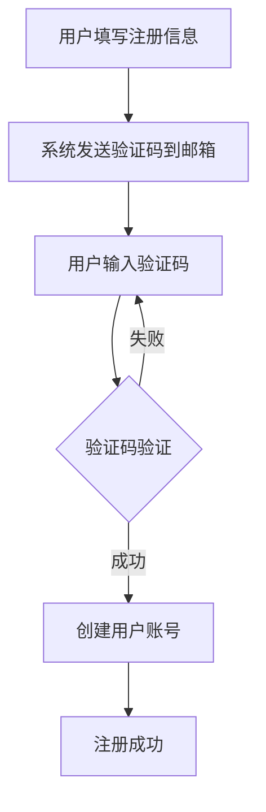
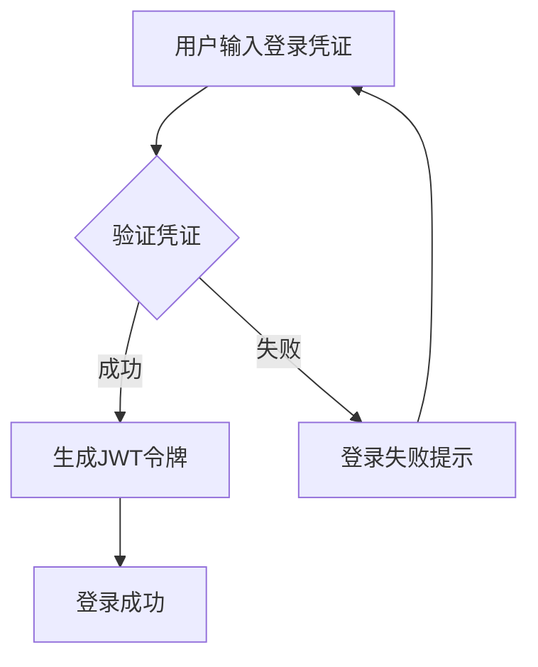
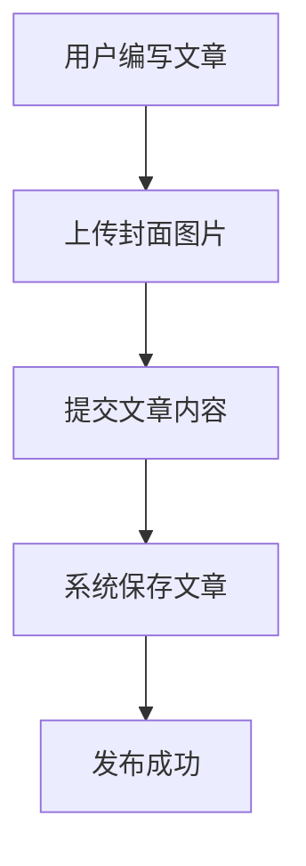
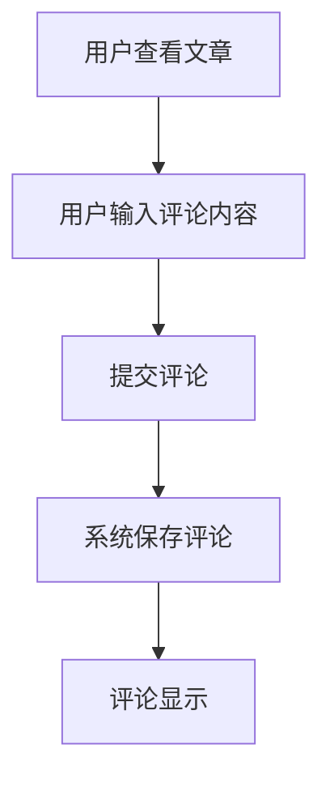

# 博客系统需求规格说明书

## 1. 简介

### 1.1 文档目的
本文档旨在详细描述博客系统的功能需求、非功能需求、用户角色与权限、系统边界、业务流程、数据需求及验收标准，为项目开发团队提供明确的开发指导和验收依据。

### 1.2 术语定义
| 术语 | 解释 |
|------|------|
| 博客 | 一种在线日志或信息分享平台，允许用户发布、编辑和删除文章 |
| 用户 | 系统的注册用户，包括普通用户和管理员 |
| 文章 | 用户发布的内容，包含标题、内容、封面图片等信息 |
| 评论 | 用户对文章发表的反馈或讨论内容 |
| 管理员 | 具有系统管理权限的用户，可以管理所有用户、文章和评论 |
| JWT | JSON Web Token，一种用于身份验证的安全令牌 |
| API | Application Programming Interface，应用程序接口 |

## 2. 功能需求（Functional Requirements）

### 2.1 用户管理模块

#### 2.1.1 用户注册
- 功能描述：允许新用户通过邮箱注册账号
- 输入：邮箱、昵称、密码、验证码
- 输出：注册成功确认
- 流程：
  1. 用户填写注册信息
  2. 系统发送验证码到用户邮箱
  3. 用户输入验证码进行验证
  4. 系统验证信息并创建账号

#### 2.1.2 用户登录
- 功能描述：允许已注册用户登录系统
- 输入：邮箱、密码
- 输出：JWT令牌
- 流程：
  1. 用户输入登录凭证
  2. 系统验证凭证
  3. 生成并返回JWT令牌

#### 2.1.3 密码找回
- 功能描述：允许用户通过邮箱找回忘记的密码
- 输入：邮箱、验证码、新密码
- 输出：密码重置成功确认
- 流程：
  1. 用户输入注册邮箱
  2. 系统发送验证码到邮箱
  3. 用户输入验证码和新密码
  4. 系统验证并重置密码

#### 2.1.4 用户信息管理
- 功能描述：允许用户查看和更新个人信息
- 输入：昵称、头像等信息
- 输出：更新后的用户信息
- 权限：登录用户

#### 2.1.5 管理员用户管理
- 功能描述：允许管理员管理所有用户
- 操作：查看用户列表、禁用/启用用户、删除用户
- 权限：管理员

### 2.2 文章管理模块

#### 2.2.1 文章发布
- 功能描述：允许登录用户发布新文章
- 输入：标题、内容、封面图片
- 输出：发布成功的文章
- 权限：登录用户

#### 2.2.2 文章浏览
- 功能描述：允许所有用户浏览文章
- 输出：文章列表、文章详情
- 权限：所有用户

#### 2.2.3 文章编辑
- 功能描述：允许作者编辑自己发布的文章
- 输入：更新的标题、内容、封面图片
- 输出：更新后的文章
- 权限：文章作者或管理员

#### 2.2.4 文章删除
- 功能描述：允许作者删除自己发布的文章
- 输入：文章ID
- 输出：删除成功确认
- 权限：文章作者或管理员

#### 2.2.5 文章搜索
- 功能描述：允许用户按标题、内容或作者搜索文章
- 输入：搜索关键词、搜索类型
- 输出：符合条件的文章列表
- 权限：所有用户

#### 2.2.6 文章分页与排序
- 功能描述：支持文章列表的分页显示和排序
- 输入：页码、每页数量、排序字段、排序方向
- 输出：分页后的文章列表
- 权限：所有用户

### 2.3 评论管理模块

#### 2.3.1 评论发布
- 功能描述：允许登录用户对文章发表评论
- 输入：文章ID、评论内容
- 输出：发布成功的评论
- 权限：登录用户

#### 2.3.2 评论查看
- 功能描述：允许所有用户查看文章的评论
- 输出：评论列表
- 权限：所有用户

#### 2.3.3 评论删除
- 功能描述：允许评论作者删除自己的评论
- 输入：评论ID
- 输出：删除成功确认
- 权限：评论作者或管理员

#### 2.3.4 管理员评论管理
- 功能描述：允许管理员查看和删除所有评论
- 操作：查看评论列表、删除评论
- 权限：管理员

### 2.4 文件管理模块

#### 2.4.1 图片上传
- 功能描述：允许登录用户上传图片作为文章封面或用户头像
- 输入：图片文件
- 输出：上传成功的图片URL
- 权限：登录用户

#### 2.4.2 文件删除
- 功能描述：允许用户删除自己上传的文件
- 输入：文件名
- 输出：删除成功确认
- 权限：登录用户

### 2.5 搜索模块

#### 2.5.1 全局搜索
- 功能描述：提供全局搜索功能，可搜索文章标题、内容或作者昵称
- 输入：搜索关键词、搜索类型
- 输出：搜索结果
- 权限：所有用户

## 3. 非功能需求（Non-Functional Requirements）

### 3.1 性能需求
- 系统响应时间：页面加载时间不超过2秒，API响应时间不超过500毫秒
- 并发用户数：支持至少1000名并发用户访问
- 数据库查询性能：复杂查询响应时间不超过1秒

### 3.2 安全需求
- 用户认证：使用JWT进行身份验证
- 数据加密：密码使用加密存储，敏感数据传输采用HTTPS
- 权限控制：基于角色的访问控制，确保用户只能访问其有权限的资源
- 防护措施：防止SQL注入、XSS攻击、CSRF攻击等常见安全威胁

### 3.3 可用性需求
- 系统可用性：系统正常运行时间达到99.9%
- 错误处理：提供友好的错误提示和异常处理机制
- 数据备份：定期对系统数据进行备份

### 3.4 可扩展性需求
- 模块化设计：系统采用模块化设计，便于功能扩展
- 接口标准化：提供标准化的API接口，支持第三方系统集成

### 3.5 兼容性需求
- 浏览器兼容：支持Chrome、Firefox、Safari、Edge等主流浏览器
- 响应式设计：适配不同屏幕尺寸的设备

## 4. 用户角色与权限

### 4.1 游客（未登录用户）
- 浏览文章列表和文章详情
- 查看评论
- 使用搜索功能
- 注册账号
- 登录系统

### 4.2 普通用户（已登录用户）
- 所有游客权限
- 发布文章
- 编辑和删除自己的文章
- 发表评论
- 删除自己的评论
- 上传图片
- 更新个人信息
- 找回密码

### 4.3 管理员
- 所有普通用户权限
- 管理所有用户（查看、禁用/启用、删除）
- 管理所有文章（编辑、删除）
- 管理所有评论（查看、删除）
- 查看系统统计信息

## 5. 系统边界

### 5.1 内部边界
- 用户管理模块：处理用户注册、登录、信息管理等功能
- 文章管理模块：处理文章的发布、编辑、删除、浏览等功能
- 评论管理模块：处理评论的发布、查看、删除等功能
- 文件管理模块：处理文件的上传、删除等功能
- 搜索模块：处理系统的搜索功能

### 5.2 外部边界
- 数据库：存储系统所有数据
- 邮件服务器：发送验证邮件和密码重置邮件
- 文件存储：存储上传的图片文件
- 前端浏览器：用户交互界面

## 6. 业务流程

### 6.1 用户注册流程

### 6.2 用户登录流程

### 6.3 文章发布流程

### 6.4 评论发布流程

## 7. 数据需求

### 7.1 数据实体

#### 7.1.1 用户（User）
- id：用户ID（主键）
- email：邮箱地址（唯一）
- password：密码（加密存储）
- nickname：用户昵称（唯一）
- avatar：头像URL
- role：用户角色（普通用户、管理员）
- status：用户状态（启用、禁用）
- createdAt：创建时间
- updatedAt：更新时间

#### 7.1.2 文章（Article）
- id：文章ID（主键）
- title：文章标题
- content：文章内容
- coverImage：封面图片URL
- authorId：作者ID（外键关联用户）
- createdAt：创建时间
- updatedAt：更新时间

#### 7.1.3 评论（Comment）
- id：评论ID（主键）
- content：评论内容
- articleId：文章ID（外键关联文章）
- userId：评论者ID（外键关联用户）
- createdAt：创建时间
- updatedAt：更新时间

### 7.2 数据关系
- 一个用户可以发布多篇文章（一对多）
- 一篇文章可以有多个评论（一对多）
- 一个用户可以发表多条评论（一对多）

## 8. 验收标准

### 8.1 功能验收标准
- 用户能够成功注册、登录和找回密码
- 用户能够发布、编辑和删除自己的文章
- 用户能够发表和删除自己的评论
- 管理员能够管理所有用户、文章和评论
- 所有用户能够浏览文章和评论
- 搜索功能能够准确查找相关内容
- 文件上传功能能够正常工作

### 8.2 非功能验收标准
- 系统响应时间符合性能需求
- 系统安全机制能够有效防止常见攻击
- 系统能够在不同浏览器和设备上正常运行
- 系统错误处理机制能够提供友好的错误提示

### 8.3 测试用例
1. 用户注册测试：验证用户能够成功注册并收到验证邮件
2. 用户登录测试：验证用户能够使用正确凭证登录系统
3. 文章发布测试：验证用户能够成功发布新文章
4. 文章编辑测试：验证作者能够编辑自己的文章
5. 评论功能测试：验证用户能够对文章发表评论
6. 搜索功能测试：验证搜索功能能够准确查找相关内容
7. 管理员功能测试：验证管理员能够管理所有资源
8. 安全测试：验证系统能够防止SQL注入、XSS攻击等安全威胁
9. 性能测试：验证系统在并发用户访问下的性能表现
10. 兼容性测试：验证系统在不同浏览器和设备上的兼容性

## 9. 风险评估

| 风险项 | 可能性 | 影响程度 | 缓解措施 |
|--------|--------|----------|----------|
| 用户数据泄露 | 低 | 高 | 实施数据加密存储，定期安全审计 |
| 系统性能下降 | 中 | 高 | 实施缓存机制，优化数据库查询 |
| 恶意评论攻击 | 中 | 中 | 实施内容过滤，提供举报功能 |
| 文件存储容量不足 | 低 | 中 | 监控存储空间使用情况，预留扩展空间 |
| 邮件发送失败 | 低 | 低 | 实施重试机制，提供备选验证方式 |

## 10. 参考资料

- Spring Boot官方文档
- Vue.js官方文档
- JWT身份验证最佳实践
- 博客系统设计模式
